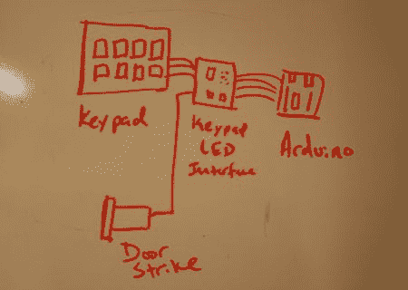
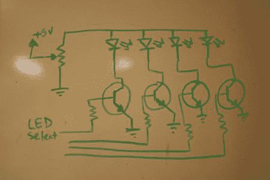
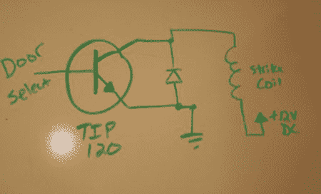
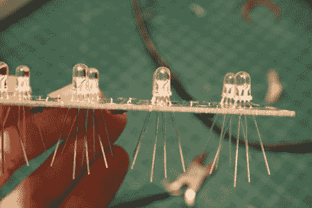
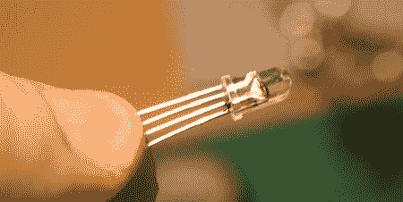
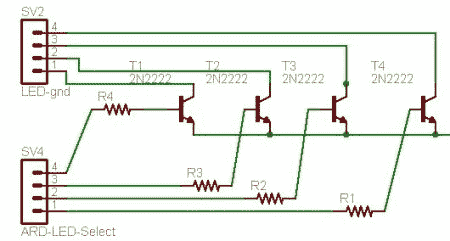
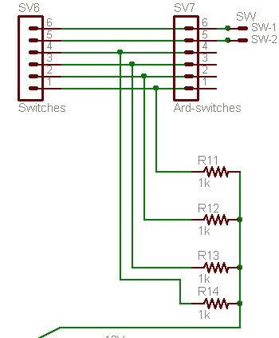
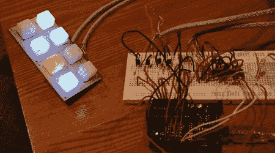
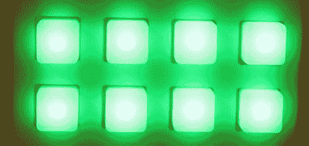

# 如何制作 RGB 密码锁(第一部分)

> 原文：<https://hackaday.com/2008/06/12/how-to-make-an-rgb-combination-door-lock-part-1/>

[*第二部分可以在这里找到*](http://hackaday.com/2008/06/20/how-to-make-an-rgb-combination-door-lock-part-2/) 
在你的空间上放一把定制设计的电子锁看起来像是一个极客的通行权。对于我们最新的工作空间，我们决定跳过无聊的数字键盘，构建一个由 Arduino 驱动的自定义 RGB 背光键盘。您的密码是一组独特的颜色，而不是键入数字。在今天的 How-To 中，我们将向您展示如何构建自己的应用程序，并为您提供实现这些功能的代码。

RGB 键盘的基本设计来自【JMG】的[基于 Arduino 的单体克隆](http://www.upwardnotnorthward.com/2008/01/my-first-project-full-colour-rgb-monome.html)。他使用 Arduino 和多路复用的 RGB LEDs 以及一些数字电位计来创建一个混色键盘。由于我们无法将完整的 4×4 键盘放入标准的 2 联墙盒中，我们将设计缩减为 2×4 矩阵。这大大降低了构建键盘的成本，并使代码更容易理解。

要构建自己的 RGB 键盘，您需要以下内容:

*   电动门罢工([Smarthome.com](http://www.smarthome.com/519012.html))
*   带锁的门把手(任何五金店)
*   Arduino 或兼容的克隆产品( [Sparkfun](http://www.sparkfun.com/commerce/product_info.php?products_id=666) 、 [adafruit](http://www.adafruit.com/index.php?main_page=product_info&cPath=17&products_id=50&zenid=d0a2bb958e7ceaf5afaf51f33dab3a1d) 及其他)
*   1 个 TIP120 晶体管
*   1 个 1N4001 二极管
*   10 个 1N4148 二极管
*   4 个 2n2222 晶体管
*   1 个单体式键盘( [Sparkfun 电子](http://www.sparkfun.com/commerce/product_info.php?products_id=7835))
*   1 个键盘 PC 板( [Sparkfun 电子](http://www.sparkfun.com/commerce/product_info.php?products_id=8033))
*   8 个 RGB 发光二极管( [Sparkfun 电子](http://www.sparkfun.com/commerce/product_info.php?products_id=105))
*   1 7805 电压调节器
*   4 个 100 欧姆电阻器
*   2 个 150 欧姆电阻器
*   8 个 1 千欧电阻器

为了可靠地锁定和解锁车门，我们订购了一款电动门锁。我们认为这是来自 Smarthome.com[的开箱商品。这是一个 12 伏的 DC 单元，专为西勒奇商业门锁设计。锁扣的边缘从安装板略微凹进，因此它可能不适用于某些锁。它的特点是比非嵌入式版本更薄的机身，这将允许我们在门框上切割一个更小但更深的孔。没有电力，罢工保持锁定，保持锁定门关闭。当 12 伏电压施加在线圈上时，撞击解除，门被拉开。对于原型建造，你还不需要购买罢工；您可以使用 LED 和电阻器来指示门锁状态，以测试您的代码。](http://www.smarthome.com/)

键盘实际上是由两个物理上重叠的独立电路构成的。输入电路是一个简单的键盘矩阵。为了读取每个按钮的按下，Arduino 将一个键盘输入线拉高，并按顺序检查四个输出线的电压。PC 板上的二极管可以防止行和列之间的反馈。

RGB led 通过一套完全独立的电路点亮。每行相同颜色的发光二极管的亮度由一个数字电位计控制。数字锅的工作原理和普通锅一样，但它是由 Arduino 数字控制的。同时，每列发光二极管由单独的晶体管激活。通过快速改变电阻和步进通过列，每个 LED 将看起来是单独控制的。

门碰电路相当简单。由于它包含一个线圈，我们将它视为步进电机的线圈，并使用 TIP120 晶体管来供电。当线圈断电时，崩溃的磁场会在线圈内产生电流。为了防止 TIP120 烧毁，我们将添加一个二极管来处理场击穿产生的浪涌。

更新:[trifid]指出二极管最好与线圈并联放置，以处理瞬态浪涌。他是正确的，但是这里的电路已经完美地运行了几个月，所以无论如何你都会很好。

按钮的轨迹看起来有点难以在家蚀刻，所以我们订购了 Sparkfun 为他们的键盘生产的 PC 板。Sparkfun 在其 eagle 库中提供了这些按键的布局，因此如果您愿意，您可以制作自己的 PCB。为了可靠性，你可能会想让它商业化生产。电路板的设计初衷并不是为了分离，但在对走线和过孔进行评估后，我们认为可以从电路板上切掉几行。

我们用带锯小心地把木板从中间劈开。如果你仔细观察，你会发现有些过孔实际上被切成了两半。(切纸刀在紧要关头可能有用)别忘了戴上口罩，以防灰尘进入肺部。

切割按钮垫就容易多了。垫子上有预先划好的线，只需要用锋利的刀或剪刀快速一划就能把它们分开。

新的更短的 PCB 只需要几个部件:一些 1N4148 二极管和 RGB LEDs。板上的丝印指示二极管和发光二极管的方向和位置。

一旦焊接上 1n4148 二极管，尽可能靠近印刷电路板切割。像这样的平头刀具工作得非常好。键盘将位于电路板的这一侧，我们希望确保它尽可能保持水平。

按照丝网指示的方向安装发光二极管。小心地将它们向下推入板中，直到它们像这样插入。如果你让它们贴得太高，它们会干扰键盘按钮的按下。

一旦你将所有的 led 焊接到位，将它们夹在一起。然后，您需要添加一些电缆，从键盘跳线到我们将构建的接口板。我们用了一些旧的 5 类电线。由于电路板的每个轴都有八个引脚，因此非常适合该应用。

每个 RGB LED 封装内有三个 LED。它们共用一个端子，并有一根单独的引线引出。因为它们有不同的特性，即亮度、电流和电压要求，我们花了一些时间来测试各种组合。我们甚至为了你谋杀了几个无辜的 2 美元 led。哎，另外两种颜色还是可以用的…

经过一些实验，我们设法找到了合适的组合来创造一些相当白光。制造商之间的要求会有所不同，但对于 Sparkfun LEDs，我们发现一对 100 欧姆的电阻和一个 150 欧姆的电阻可以很好地混合红色、绿色和蓝色。

直到我们把键盘放在 LED 上仔细检查我们的发现，这种颜色组合才让我们觉得不舒服。在现实生活中，你可以从每个 LED 的偏移中看到一些融合线，但看起来仍然很棒。

这个电路有大量的元件，但是很容易制造。为了简单起见，我们会将所有内容按部分进行分解。你可以在这里下载 Arduino [的所有原理图、Eagle 项目文件和代码。](http://biobug.org/rgb-keypad/)

数字锅有六路输出。每一个都将通过颜色匹配电阻为一排红色、绿色或蓝色的发光二极管供电。数字电位计布线直接来自[本指南](http://www.arduino.cc/en/Tutorial/SPIDigitalPot)。如果您需要更多信息，可以阅读它，或者使用我们的快速版本:

*   将 AD5206 的引脚 3、6、10、13、16、21 和 24 连接到 5v。
*   将引脚 1、4、9、12、15、18、19 和 22 接地。
*   将 pot 引脚 5 连接到 Arduino 引脚 10
*   将 pot 引脚 7 连接到 Arduino 引脚 11
*   将 pot 引脚 8 连接到 Arduino 引脚 13

抓住四个 100 欧姆的电阻和两个 150 欧姆的电阻。将它们排成一行放在试验板上，每一端放在单独的总线上。(穿过电路板的中心是最容易的)将键盘的六条 LED 引线连接到每个电阻的一端——红色连接 150 欧，蓝色和绿色连接 100 欧。下面是我们使用的连接顺序。

*   RED3 连接到 150 欧姆电阻，以封装引脚 14
*   格雷 EN3 至 100 欧姆电阻至 pot 引脚 11
*   BLUE3 至 100 欧姆电阻至 pot 引脚 2
*   RED4 连接到一个 150 欧姆的电阻，以封装引脚 23
*   格雷 EN4 至 100 欧姆电阻至 pot 引脚 20
*   BLUE4 至 100 欧姆电阻至 pot 引脚 17

为了将 LED 总线接地，我们将使用四个 2N2222 晶体管。Arduino 将通过一个 1k 欧姆的电阻单独触发每个晶体管。每个晶体管的集电极连接到键盘的地线。每个晶体管的发射极接地。四条晶体管选择线连接到 Arduino 引脚 0、1、2 和 3。是的，它们在中被标记为模拟，但这无关紧要。

键盘开关矩阵连接成四列两行。四列中的每一列都有一个下拉电阻。R11、R12、R13 和 R14 使用 1kω电阻；一根导线连接到立柱，另一根接地。

Arduino 引脚 2 和 3 应连接到两条未接地的线路，这两条线路在 PC 板上标记为 SWITCH3 和 SWITCH4(原理图上的 5 和 6)。

Arduino 引脚 6、7、8 和 9 应连接到标记为 SWT-GND1、SWT-GND2、SWT-GND3 和 SWT-GND4(原理图上的 1-4)的四条输出线。

电路板的最终版本采用 12v 直流输入来驱动门锁。我们添加了一个 7805，将 Arduino 的 12V 降至 5V。原型版本不需要，除非你想测试射手。Arduino 有一个板载调节器，但 7805 很便宜，它有助于减少 Arduino 内置调节器的负载。对于代码开发，我们只是将一个带电阻的 LED 连接到控制门锁的输出线上。

原型板上的所有东西都装好了，是时候进行测试了。幸运的话，你很快就会得到回报，在你娇嫩的手指下有几个 RGB 发光二极管在跳动、发光。

对 Arduino 编程易如反掌。在这里下载你的操作系统软件[。现在按照](http://www.arduino.cc/en/Main/Software)[入门指南](http://www.arduino.cc/en/Guide/HomePage)让 Arduino 软件与 Arduino 板对话。一旦你享受了闪烁的 LED 演示，回到这里，让你的键盘滚动。

一旦你设置并测试了你的 Arduino，就该测试你的原型了。从[这里](http://biobug.org/rgb-keypad/)下载 button_test 代码。将其粘贴到新的草图中，并上传到 Arduino。单击串行控制台按钮，您应该开始看到窗口中的点积累。如果您按下 pad 上的按钮，Arduino 应该会向控制台打印一条消息，并切换锁定输出状态。

一旦你的按钮经过测试，你可能会想试试你的 led 灯。从[同一个页面](http://biobug.org/rgb-keypad/)中抓取 RGB_light_fade 例程并上传到你的 Arduino。你应该去看一场精彩的小型灯光秀。这是我们最喜欢的演示，因为它真正展示了数字电位计的混色能力。

在你的 led 和按钮工作的情况下，你可以从同一个地方抓取 row_entry_pad_meffect 锁码并上传。现在键盘应该开始闪烁蓝色按钮，而它是空闲的。按键时，按键会改变颜色。通过输入正确的颜色代码，密码板将闪烁绿色并解锁车门 10 秒钟。如果你越过极限计数器，它将闪烁红色 30 秒。

下次我们将向您展示如何制作键盘的永久版本，浏览 Arduino 的代码，制作 PC 板，切割定制墙板，以及安装锁扣。