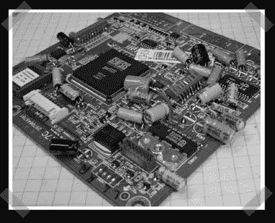

# 如何制作自己的 XBox 360 笔记本电脑(第 2 部分)

> 原文：<https://hackaday.com/2007/04/27/how-to-make-your-own-xbox-360-laptop-part-2/>

该死。我并不完美，但我很恼火，尽管我检查了它，但当本·赫克的 XBox 360 笔记本电脑的[第 2 部分](http://www.engadget.com/2007/04/25/how-to-make-an-xbox-360-laptop-part-2/)出现时，我错过了它。在这一轮中，有许多零件需要改装。从散热器到盖子，你必须把它们都做得更小。

*   [永久链接](http://www.engadget.com/2007/04/25/how-to-make-an-xbox-360-laptop-part-2/)