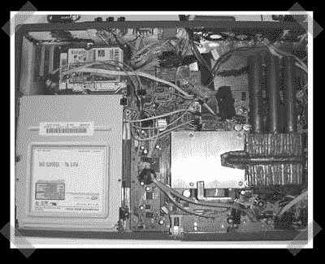

# 如何:制作自己的 XBox 360 笔记本电脑(第 3 部分)

> 原文：<https://hackaday.com/2007/05/22/how-to-make-your-own-xbox-360-laptop-part-3/>

【本】终于得到了[第三部分](http://www.engadget.com/2007/05/22/how-to-make-an-xbox-360-laptop-part-3/)他的 XBox 360 笔记本电脑的操作指南。这是这个系列的最后一部分。他用它来连接端口、按钮、键盘和最后的组装。有很多商店处理特殊订单激光切割-所以不要开始认为这种项目是你的课。如果你曾经做过汽车模型，并且会使用烙铁，你肯定可以自己做一个。

今天早上我刚刚检查了最后一件作品——但是感谢[托尼]首先注意到了它。

*   [永久链接](http://www.engadget.com/2007/05/22/how-to-make-an-xbox-360-laptop-part-3/)