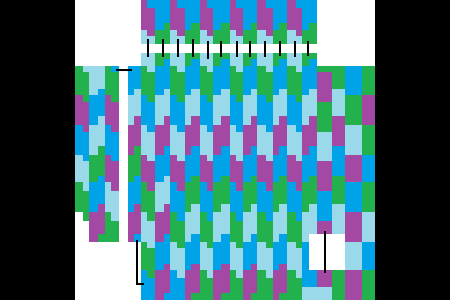
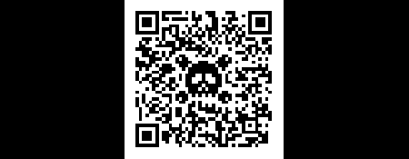
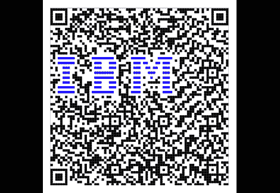
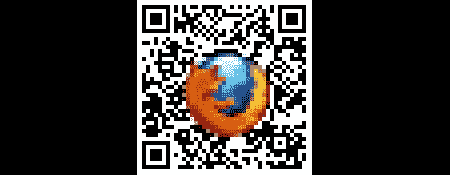
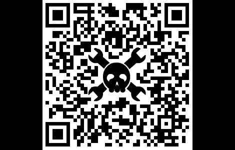

# 如何把你的标志放在二维码里

> 原文：<https://hackaday.com/2011/08/11/how-to-put-your-logo-in-a-qr-code/>

在某人黑二维码上写了[这篇文章](http://wp.me/pk3lN-drT)后，[黑了一天的评论者](http://hackaday.com/2011/08/09/hacking-qr-codes-for-fun-and-profit/#comments)出来全力张贴一些[非常酷的链接](http://2d-code.co.uk/bbc-logo-in-qr-code/)关于修改二维码以包含一个标志。我完全承认我有点怪，但在这个过程中，我明白了在二维码中嵌入徽标背后的一些理论。

在得到 ISO 18004 的二维码规范后，我决定尝试将 Hack A Day skull &扳手嵌入到二维码中。我用的工具有 Photoshop，[这个二维码生成器](http://www.racoindustries.com/barcodegenerator/2d/qr-code.aspx)，还有微软画图(我从来没见过哪个编辑单个像素的程序有更好的 UI，不要见笑)。

在这个“操作方法”中，我将介绍修改第 6 版二维码的过程。第 6 版 QR 码为 41 像素见方，在可以呈现的数据量和代码本身的物理大小之间取得了非常好的平衡。下图显示了版本 6 QR 码标准的绝对要求。在实践中，实际需要的东西有一点不同，但我现在只考虑规格。

该图形中的黑色将*始终*为黑色，该图形中的白色像素将*始终*为白色，红色为“禁止区域”，灰色为“无关紧要”二维码顶部和左侧的黑白交替带是“定时模式”。就是这一点点把二维码上的所有东西分成了列和行。该图形的灰色部分分为 172 个 8 像素区域，如下所示:

*如果有人想要 4 色地图定理这个，我会很乐意更新它。*

其中一些区域是不连续的，所以我画了黑线连接相应的部分。这些 8 像素部分中的每一个都转化为一个字母数字 QR 码中的一个字节的数据。现在，百万美元的问题:为什么知道二维码中的字节是如何排列的很重要？答案是高水平的纠错，这些字节中大约 30%可以是完全的胡言乱语，你的手机仍然可以读取二维码。有 172 个区域，这意味着其中大约 51 个可以以任何方式、形状或形式改变。

那么，我们如何实现这一点呢？首先，我们从一个糟糕的 Hack A Day 徽标开始:

设计这个标志时，重要的是要包括正面和负面的空间。如果徽标周围没有白色边框，随机的黑白像素将紧靠徽标放置。当然，我肯定有人会提出一个忽略这种技术的伟大设计，但是*我现在就这么做*。将 Hack A Day 徽标覆盖在二维码的彩色地图上后，我们会看到:

然后我们*实际计算*被徽标遮挡的 8 个像素单元的数量。由于我们正在做一个版本 6 的二维码，大约 51 个这样的细胞可以被覆盖。看起来这个图形没问题，所以我们进入下一步:在这个东西里放一个真正的二维码。

我用[这个网站](http://www.racoindustries.com/barcodegenerator/2d/qr-code.aspx)为这篇文章生成了我所有的二维码。它允许您选择 QR 版本号和纠错级别。输入“【http://www.hackaday.com】T2&# 8221 后；作为我想要嵌入的代码，我以这个结束:

这个小家伙会出现在我们的名片上。

这一切都很好，但如果你想把一个标志放在一个比“通常”允许的略大的二维码上呢？例如，如果您想要进入二维码顶部和左侧的计时区域，该怎么办？这就是设计的用武之地。如果一个标志已经有了交替的黑白像素，比如美国电话电报公司的“死星”,那么这个标志就很容易与时间模式重叠。

是的，我用了 14 版本的二维码，这意味着它的边长为 73 像素。我确实想出了[小一点的](http://hackaday.com/wp-content/uploads/2011/08/ibm-logo1.png)，但是看起来真的不怎么样。

注意蓝色的条。二维码解读者不在乎像素是白色、黑色、红色、橙色还是栗色，只有对比度才重要。由于“大蓝色”中的蓝色相当暗，因此它被注册为暗像素。这可以通过增加视觉对比度和去除 1 位图形所需的 1 像素边框来利用。

如果火狐的标志有白边，标志将覆盖超过 30%的二维码。使用全彩图形——特别是在背景上用黑色边缘定义自己的图形，比如图标——可以避免在标志周围使用白色边框的需要。我确信还有更聪明的方式来玩弄一个标志的调色板，但我会让它在另一个时间。

但是等等，还有更多。我不局限于二维码的分辨率——我可以用比二维码更高的分辨率覆盖东西。这个观察让我想到了这个:

是的，它有效。

我希望这个操作方法至少对演示如何将徽标放入二维码有一点帮助。如果你有一个很好的例子，请在评论中留言或发送到[提示行](http://hackaday.com/contact-hack-a-day/)。