# 如何:更换迷你 USB 端口(在你的手机上)

> 原文：<https://hackaday.com/2007/11/08/how-to-replace-a-mini-usb-port-on-your-cellphone/>

在某个时候，几乎每个人都会把自己珍贵的电子产品弄乱。在这种情况下，有人(不是我)设法完全摧毁了他们的新摩托罗拉手机的迷你 USB 端口。如果没有一些重要的工具，表面贴装维修可能会很有挑战性，但在没有重新工作站的情况下更换零件是可能的。(猜猜今年我会得到什么圣诞礼物。)今天，我将向您展示用一些相当便宜的工具来修复表面贴装器件是可能的。

要进行修复，您只需要一些工具:

*   细尖烙铁(韦勒 15 瓦)
*   带有切割轮的 Dremel 工具
*   脱焊编织物
*   Torx T5 螺丝刀
*   小型平刃螺丝刀(可选)
*   对角切割器
*   小止血钳或细镊子
*   手持设备、辅助设备或类似的台式手持设备。

我已经有了所有的焊接设备，但我必须找到一个新的 T5 驱动程序，因为我的消失了。我在西尔斯买了一个质量不错的涂有氧化铁的 T5 驱动程序，价格略高于 3 美元。西尔斯其实这些都是单独的，不需要买一套。
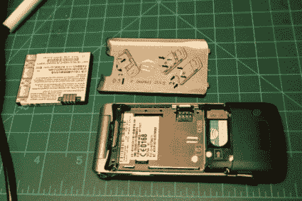
要开始使用，取下后盖并取出电池。

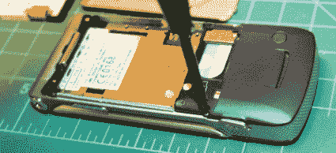
接下来，取出 Torx T5，卸下固定手机的螺丝。这次只需要移除四个。

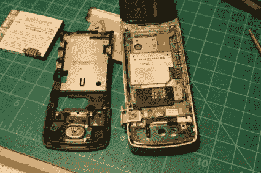
用螺丝拧出，轻轻将手机拉开。这个摩托罗拉的下半部分夹在一起，所以我用一个小平头螺丝刀轻轻地在边缘周围工作，直到它分开。

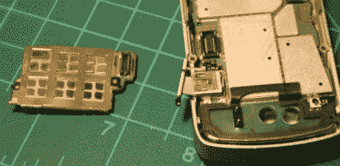
SIM 卡板通过扁平的 SMD 连接器轻松与手机分离。只需在连接器附近轻轻施加压力，它就会马上脱落。

接下来，需要以同样的方式拆下扁平带状电缆，并从手机上取下主 PC 板。一旦电缆断开，它应该会立即拔出。

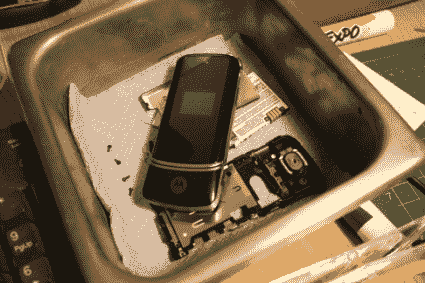
当你拆卸手机时，把每一件都放进零件箱。任何种类的容器都可以，但我会避免产生静电的塑料特百惠容器。

小心地将板放入你的夹子/老虎钳/无论什么——我必须将按钮与老虎钳上的槽对齐，否则当我夹住板时可能会损坏它们。

在你修理任何东西之前，你需要一个新的连接器。我从 [Mouser electronics](http://www.google.com/url?sa=t&ct=res&cd=1&url=http%3A%2F%2Fwww.mouser.com%2F&ei=2YMyR-DjEqW6hAKNiuyPAg&usg=AFQjCNEL2XlpJ3nONUSPW6o74OfVQfSzdw&sig2=X-ubEgxKPuEFASjVJa16NQ) 订购了这个新的 SMD mini USB 端口(零件号 538-67503-1020)。几乎是完全相同的部分，一直到顶部的黄色胶带。

为了检查针脚的状况，用一把对角钳夹住将后屏蔽固定在连接器上的两个凸片(也可以使用 Dremel/旋转工具)。

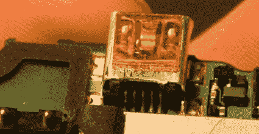
卸下后护板后，我们可以接触到后面的针脚——与前面不同，一切看起来都很好。表面贴装器件的优点是不需要太多的焊料来固定在一起。不幸的是，当你更换表面贴装器件时，少量的焊料会使你无法在不损坏电路板的情况下取下器件。

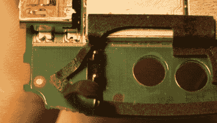
为了防止这种泡沫封口烧焦，把它剥下来贴在一边。

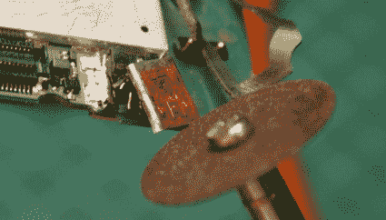
输入旋转工具。通过纵向切割侧面来切掉连接器的顶部。

一旦顶盖被卸下，针的损坏是相当惊人的。哎哟！当我开始切的时候，我把那个泡沫封条剥掉了。注意，第四个大头针实际上被向内向上推了一点点。

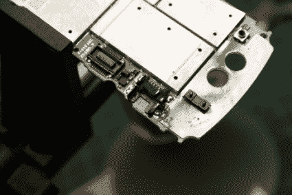
接下来，横切连接器的中心。应轻轻剪断弯曲的针脚，否则塑料连接器的上半部分可能会脱落。应切割侧面的屏蔽，以允许单独移除每个支腿。(注意不要切到下面的 PC 板！)

从一边到另一边，加热每个引脚上的焊盘。然后用一些镊子夹住连接器的每一个针脚。(我用了一个小鳄鱼钳)如果焊料足够热，表面贴装引脚应该很容易松动。尽可能温和地对待每一个人是至关重要的。PC 板上的焊盘非常脆弱，如果不小心，很容易被拉起。不幸的是，焊盘过热也会导致它们上拉。所以动作要快！

把精致的大头针移开，我小心翼翼地切开剩余的塑料，把它拿走。

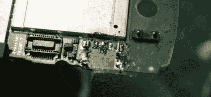
最后，将剩余的屏蔽腿加热并从板上取下。

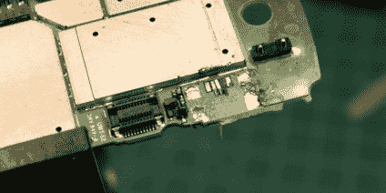
之后，我用脱焊辫去除焊盘上多余的焊料。并非一切都完美无缺。倒数第二个垫子没有通过移除程序。在这种情况下，我敢肯定，当连接器被破坏时，引脚受到了一些影响。我小心翼翼地不去扭掉它们，但是考虑到端口惊人的损坏程度，一个衬垫没有成功我并不惊讶。

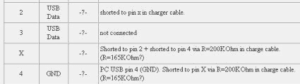
在[这个](http://pinouts.ru/CellularPhones-A-N/razrv3_charger_pinout.shtml)摩托罗拉充电器插脚引线上，有问题的插脚编号为 X。它通过一个电阻短接到引脚 2，表示连接了充电器。不幸的是，这款手机再也不能用墙上的充电器充电了(除非把电路板换下来。)用导电笔重建痕迹是可能的，但我怀疑这是否会成功。

现在我们为新港口做好了准备。原始版本和替换版本之间有一个区别:两个引脚用于对齐板上的端口。它们是塑料的，所以很容易修理。

用你的滚磨工具磨掉它们，使连接器底部光滑。之后，像以前一样，夹住新端口上的凸耳，并移除后屏蔽。

新端口对齐后(仔细检查后面的针脚！)将一个屏蔽腿焊接到电路板上。再次仔细检查引脚排列，并焊接其他引脚。现在端口应该安装牢固了。

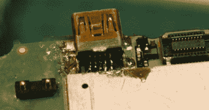
接下来，新端口上的管脚需要焊接。我的 15 瓦韦勒铅笔上的超精细笔尖使这变得很容易。或者，你可以用一个更宽的尖端来焊接东西，然后用脱焊编织带来去除任何焊桥。如果你忘记移除后护板，你将有一个地狱的时间焊接引脚。在这款特殊的手机上，端口后面的金属屏蔽使得不移除后屏蔽就无法接触到引脚。

尽管丢失了 pin 码，但当我们插上电源时，手机启动正常。又一部从回收站存下来的手机。