# 如何:在鼠标中搜寻部件

> 原文：<https://hackaday.com/2008/05/16/how-to-scavenge-a-mouse-for-parts/>

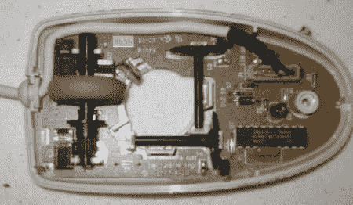
*克里斯·基克在本周早些时候发布了关于[蜂群机器人](http://www.hackaday.com/2008/05/13/swarm-robotics/)的帖子，今天发布了他的第一篇每日黑客指南。*

旧的电脑鼠标正被大量抛弃。它们被扔掉是因为肮脏、陈旧或者颜色太浅。任何一个有电脑的人通常都有不止一个鼠标，你可以花几分钱买到，如果不是免费的话。幸运的是，对于有鉴别力(阅读:廉价)的黑客来说，这些小部件充满了项目部分。今天的 How-To 将解剖一个计算机鼠标，提取有用的部分，并给出一些如何使用它们的想法。

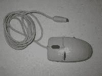 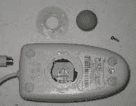
这里我们有一只标准的 PS2 老鼠；USB 鼠标看起来也差不多。我们稍后将讨论光学鼠标。

让我们打开它。首先，拿出鼠标球。然后底部会有一个或多个螺钉需要取出。螺丝有时会藏在橡胶垫下面。

首先要注意的是线缆连接器。大多数鼠标都有一个非常方便的电缆插头，而不是将其焊接到电路板上。这是第一个可用的部分:一根 4(或 6)导线电缆，一端有一个漂亮的插头。插座可以从 PCB 上拆下，用于其他项目。

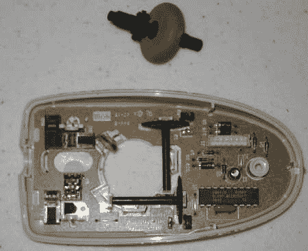
随着绳索的移开，我们可以开始拉出零件了。首先弹出的是鼠标滚轮。是的，它只是一个大橡胶轮。如果你对鼠标滚轮的点击声感到厌烦， [你可以让它静音](http://www.hackaday.com/2007/12/04/silence-your-mouse-no-clicky/)。鼠标滚轮下方至少有两个微型开关，通常还有第三个，可用于碰撞传感器或按钮。

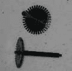
接下来要取出的是两个塑料开槽圆盘。它们是编码器轮。只要鼠标移动，它们就会转动，并中断红外线光束，产生脉冲。过去，精密编码器轮非常昂贵，但现在不是了。每个单个(非光学)鼠标都内置了一对。

编码器轮的两边是一些小盒子。一侧是红外发射器，另一侧是一对红外探测器。有时发射器和探测器是一个完整的单元。使用一对检测器是因为 2 个检测器稍微偏移，它产生[正交编码](http://en.wikipedia.org/wiki/Rotary_encoder#Incremental_rotary_encoder)，所以鼠标知道旋转的方向。

这些红外发射器和探测器是相当模块化的部件，当涉及到黑客攻击时，可以小心地拆下来。在移除它们之前，最好使用万用表来查看它们的电压。它们可能是 TTL 部件，因为鼠标由 5v 供电，但有时它们甚至是更低的电压。发射器/检测器对本身可以直接与[接口](http://www.societyofrobots.com/schematics_infraredemitdet.shtml)。这些部件可以单独用于[接近传感器](http://www.ikalogic.com/ir_prox_sensors.php)或[线跟随机器人](http://www.kmitl.ac.th/~kswichit/ROBOT/Robo5.html)。

添加一个编码器轮，这种传感器设置有很多用途。从转速表到风速指示器，再到感应机器人的速度，这个都可以做到。正交输出(经过一些解码)可用于测量距离、方向和速度。

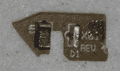 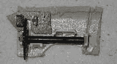
使用带有红外传感器的编码器的一个棘手问题是让发射器与探测器对齐。没问题:不用从 PCB 上拆焊零件，而是用旋转工具切下上面有传感器的那一小块 PCB(已经排好了)。然后可以将导线焊接到另一侧的引脚/走线。如果固定编码器轮有问题，可以使用一大块鼠标外壳。一定要留够 PCB，让它在鼠标外壳上保持稳定。

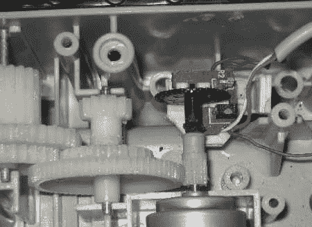
这是一个小机器人上的 PS2 鼠标与编码器轮正交的图片。鼠标被切开，整个组件被安装到电机轴上，而不是定制零件。

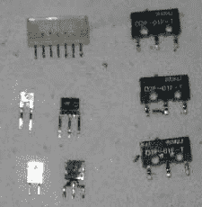
鼠标上还剩下什么可以打捞的？鼠标滚轮的传感器。根据型号的不同，鼠标滚轮的移动可以通过开关或低分辨率编码器来检测，适合测量慢速旋转。

最后一位是鼠标控制器芯片。乍一看，它似乎没什么用处:它是一个单一用途的部件，专门用来运行电脑鼠标，除此之外别无它用。然而，如果你的控制器芯片不是一个匿名的 blob，数据表可能会很有启发性。 [Octopart](http://octopart.com/) 可以根据芯片的零件号帮助查找数据表。[这张](http://www.digchip.com/datasheets/download_datasheet.php?id=297606&part-number=EM84510F) (PDF)是鼠标控制器的典型数据表。

这个特定的部分做了许多有用的事情:

*   解码来自编码器的正交输入
*   在一组寄存器中保存编码器脉冲数的连续计数
*   过滤抖动
*   微动开关去抖并跟踪其状态
*   将信息打包并通过线缆发送出去。

对于一只 PS2 鼠来说，获得这些特征并不太难。PS2 协议非常友好，甚至对于微控制器也是如此。这里有一个[用鼠标](http://www.arduino.cc/playground/ComponentLib/Ps2mouse)连接微控制器的例子。对于 USB 鼠标，查一下控制器的数据表，看能不能同时做 PS2 和 USB；对年长的老鼠来说，这种可能性很大。虽然纯 USB 不太容易与微控制器通话，但它真的很容易与 PC 挂钩(使用正确的软件)。

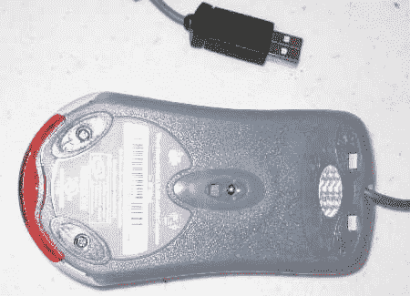 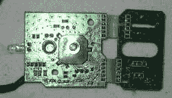
我们答应一看光电鼠标。光电鼠标没有任何旋转编码器。鼠标滚轮仍然有一些开关和一个低分辨率编码器。光学鼠标中有一个迷你摄像头、灯和镜头。灯可能是一个相当标准的 LED，尽管它们往往很亮，而且透镜是专门制造的。然而，有可能将[直接连接到迷你相机](http://www.martijnthe.nl/optimouse/arduino-optical-mouse.html)或[上，将其用作一个非常糟糕的扫描仪](http://spritesmods.com/?art=mouseeye)。

我们希望这个操作方法已经激发了一些想法，并且你过时的鼠标不会再看起来没用了。