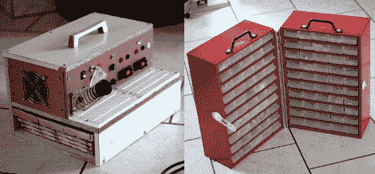

# 如何随身携带一个旅行电子实验室

> 原文：<https://hackaday.com/2011/08/01/how-to-take-a-travelling-electronics-lab-on-the-road-with-you/>

如果你经常旅行，或者如果你没有车库或地下室，并且发现你的厨房桌子注定要作为电子工作台使用大部分时间，那么这个方法适合你。[Robovergne]想出了[一个移动电子实验室](http://www.robovergne.com/fr/electro/labo-mobile/)([翻译为](http://translate.google.com/translate?js=n&prev=_t&hl=en&ie=UTF-8&layout=2&eotf=1&sl=auto&tl=en&u=http%3A%2F%2Fwww.robovergne.com%2Ffr%2Felectro%2Flabo-mobile%2F))，以帮助保留妻子对他的爱好的接受因素。

该项目分为两部分。右边是一对组件存储柜。这些都是高质量的例子，完全封闭每个抽屉(较便宜的橱柜在后面是开放的)。通过这种方式，[Robovergne]能够用钢琴铰链将它们连接在一起，并在顶部添加一些提手。

项目的后半部分是板凳本身。它具有实验室供应，烙铁变压器和持有人，以及一些试验板的良好措施。这个单元的底部有一个抽屉，里面放着他的大部分工具。现在，他可以在一次旅行中收拾行李，清理客厅。