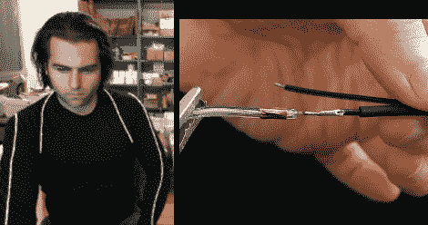

# 如何使用电线

> 原文：<https://hackaday.com/2010/12/07/how-to-work-with-el-wire/>

如你所见，[菲利普·托伦]在电影首映式的创服上有一个不错的开始。电致发光线是让这些服装发光的东西，如果你在享受美食之前从未使用过这种材料。Adafruit 在[上发布了一个教程，解释如何使用 EL wire](http://www.ladyada.net/learn/el-wire/) 。这个过程并不难，但他们有一些不错的技巧，比如使用铜带作为焊接电晕线的平台。还讨论了为您的设置正确供电所涉及的数学问题。

在这种情况下，Adafruit 使用的是现成的电源逆变器单元。如果你对组装自己的逆变器感兴趣，看看来自[Jeri Ellsworth] 的背景信息。