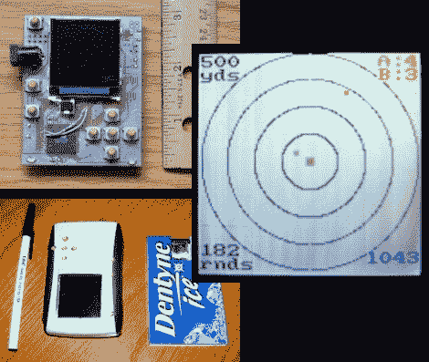

# 现实生活中捕捉旗帜的平视显示器

> 原文：<https://hackaday.com/2010/02/11/hud-for-real-life-capture-the-flag/>

如果你玩过《分裂细胞》游戏，你会记得(山姆·费舍尔)随身携带的 PDA。如果你在玩夺旗游戏的时候也能有一个自己的呢？[布拉德]创造了[西风眼作为现实生活游戏](http://bradsprojects.wordpress.com/2010/02/09/zephyreye-on-toms-hardware/)的电子命令和通信设备。

每个玩家都带着自己的单位。ZephyrEye 有一个 GPS 模块、Xbee 模块、LCD 屏幕和控制按钮。这允许玩家设置几个不同游戏中的一个，绘制包括基地位置和旗帜位置的游戏场地，并监控时间限制和得分。其他玩家可以加入正在进行的游戏。最精彩的部分？GPS 模块向每个手持设备报告跟踪情况，并作为你的团队和敌人团队的雷达。休息之后我们有几个演示视频。

言语无法形容这让我们当时有多高兴。我们不再和其他邻居的孩子在外面玩了(在这里插入一个老男人的笑话)，但这可能会因为这个设备而改变。我们最终可能会加入到一些令人惊叹的激光枪战游戏中。

[Brad's]贴出了硬件信息和源代码，这样你就可以用它来组装十几个单元。我们认为下一个版本应该包含可穿戴显示器。

[https://www.youtube.com/embed/w-MWm8Eqn00?version=3&rel=1&showsearch=0&showinfo=1&iv_load_policy=1&fs=1&hl=en-US&autohide=2&wmode=transparent](https://www.youtube.com/embed/w-MWm8Eqn00?version=3&rel=1&showsearch=0&showinfo=1&iv_load_policy=1&fs=1&hl=en-US&autohide=2&wmode=transparent)

[https://www.youtube.com/embed/xUKLX4FYfAI?version=3&rel=1&showsearch=0&showinfo=1&iv_load_policy=1&fs=1&hl=en-US&autohide=2&wmode=transparent](https://www.youtube.com/embed/xUKLX4FYfAI?version=3&rel=1&showsearch=0&showinfo=1&iv_load_policy=1&fs=1&hl=en-US&autohide=2&wmode=transparent)

[via [汤姆指南](http://www.tomsguide.com/us/pictures-story/146-11-sparkfun-makers-inventions.html)