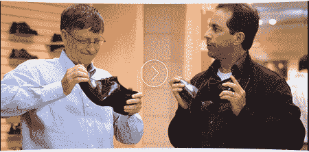

# 人性化的微软

> 原文：<https://hackaday.com/2008/09/05/humanizing-microsoft/>

好吧，你可能已经看过了。如果没有，现在就去看新的微软商业广告。广告本身没什么了不起的。这显然是试图将比尔·盖茨和微软人性化。[比尔]笨拙的台词几乎是可爱的。我们甚至可以开始喜欢他。想象一下，他像我们其他人一样，作为一个处理软件的普通人在这个世界上跌跌撞撞。他会改变吗？我们能得到一部有比尔盖茨和 T2 约翰·霍吉曼的情景喜剧吗？你会看吗？我们会的。