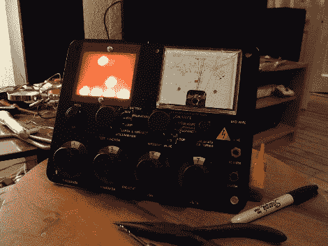

# 混合模拟/二进制时钟，MK2

> 原文：<https://hackaday.com/2010/01/30/hybrid-analogbinary-clock-the-mk2/>

[Kieran]让我们了解一下他的[混合模拟/二进制时钟](http://sites.google.com/site/kieransbinaryclock/)。时钟背后的电路并不太新。一个 Arduino 与一个[计时点](http://hackaday.com/2009/10/27/parts-chronodot-rtc-module-ds3231/)相结合，产生一个精确的时钟。然而，我们真正喜欢的是一个老英国电信巡边员的万用表的创造性实现。[模拟仪表](http://hackaday.com/2010/01/16/volt-meter-clock/)充当秒针，而另一个由 led 和条形板组成的显示器是二进制时钟。最终产品非常有创意。