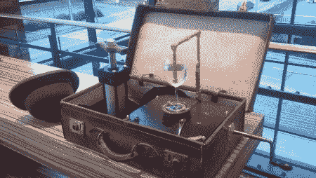

# 氢化可的松可能不会让你精神错乱

> 原文：<https://hackaday.com/2011/10/21/hydrocrystallophone-probably-wont-make-you-insane/>

[Fish]为他的最新作品[水晶体手机](http://www.attoparsec.com/artifacts/hydrocrystallophone.html)感到非常自豪。这种新乐器让我们想起了*更为*的蒸汽朋克版【本尼·富兰克林】的[格拉斯·阿蒙尼卡](http://www.youtube.com/watch?v=eQemvyyJ--g)——据报道，这种乐器让演奏者陷入了一种“[黑暗和忧郁的情绪](http://en.wikipedia.org/wiki/Glass_harmonica#Purported_dangers)”

该建筑基于 20 世纪 20 年代的手摇留声机马达。留声机马达转动装满水的酒杯。水位(以及酒杯产生的音调)是通过连接到液压缸的玻璃杯内的铜管来改变的。推动和推动液压缸的手柄会导致玻璃杯中的水位发生变化。

我们以前都看过[酒杯音乐](http://www.youtube.com/watch?v=ULiNR-k4m70)，但这是我们第一次只用一个杯子看。[Fish]正在修改留声机的调速器，以消除 78 转/分钟对水的影响。他还没有完全掌握他的新音乐发明，但我们迫不及待地想看看[鱼]通过一些练习能够演奏什么。

如果你在跟踪 Hack A Day 上被归入“为什么我没有想到这个”类别的乐器，Hydrocrystallophone 将是几个月来第二个这样的乐器。这是一个非常简单但非常巧妙的装置。休息后，请查看 Hydrocrystallophone 的视频。

[https://www.youtube.com/embed/rQVlPl2-mmw?version=3&rel=1&showsearch=0&showinfo=1&iv_load_policy=1&fs=1&hl=en-US&autohide=2&wmode=transparent](https://www.youtube.com/embed/rQVlPl2-mmw?version=3&rel=1&showsearch=0&showinfo=1&iv_load_policy=1&fs=1&hl=en-US&autohide=2&wmode=transparent)