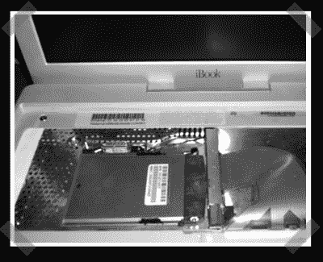

# IBook 无线改造

> 原文：<https://hackaday.com/2007/02/16/ibook-wireless-retrofit/>

【squishy】送来了他的 iBook 改装[项目](http://squishydale.fortunecity.com/quasibook/The%20Wireless%20Card.html)。通常笔记本电脑不会引起我的注意，但是无线网卡吸引了我的注意。因为他的易趣交易没有附带机场卡，他用奥森 200 兆瓦的无线网卡改装了它。该卡非常合适，并且在天线连接器上做了一些 dremel 工作，在 linux 下它是即插即用的。

*   [永久链接](http://squishydale.fortunecity.com/quasibook/The%20Wireless%20Card.html)