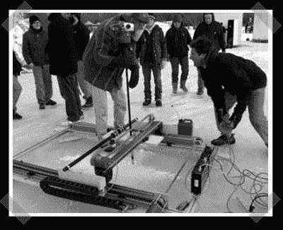

# 冰雕机器人

> 原文：<https://hackaday.com/2008/07/15/ice-carving-robot/>

【Bruce】和【Jesse】前阵子组装了一个[冰雕机器人](http://jessehemminger.com/art-shanty/)。在很大程度上，它是一台放置在冰面上的数控机床。为了处理实际的冰面切割，他们选择了一种由除草机转动的超级旋转工具。

*   [永久链接](http://jessehemminger.com/art-shanty/)