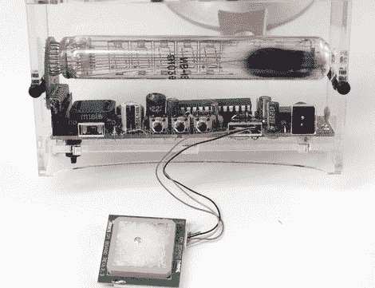

# 冰电子管时钟 GPS

> 原文：<https://hackaday.com/2010/07/29/ice-tube-clock-gps/>

我们最喜欢的苏联时代的显示器找到了进入现代[套件的方法](http://www.adafruit.com/index.php?main_page=product_info&cPath=39&products_id=194)现在[显示来自轨道卫星](http://www.ladyada.net/make/icetube/mods.html)的时间。一个全球定位系统模块被植入一个冰管时钟，通过[修改的固件](http://github.com/adafruit/Ice-Tube-Clock/tree/GPS/firmware/)将能够提供一个卫星同步时间。由你真正修改的固件，解析 GPS 模块的 NMEA RMC 语句的时间和日期信息，然后更新时钟的时间和日期。有趣的是，当 GPS 更新时间时，确保闹钟在正确的时间响起。总的来说，这是一个有趣的项目，我们期待看到更多的冰管时钟黑客。