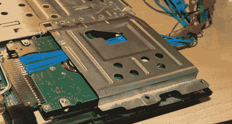

# IDE 总线嗅探和硬盘密码恢复

> 原文：<https://hackaday.com/2011/04/28/ide-bus-sniffing-and-hard-drive-password-recovery/>

shackspace 成员[@dop3j0e] [在他的 ThinkPad 指纹扫描仪死机](http://shackspace.de/?p=1976)后，当他试图恢复一些数据时，发现自己陷入了真正的困境。你看，他把自己的硬盘密码存在了扫描仪里，久而久之就完全忘了密码是什么了。一旦扫描仪停止工作，他就没有办法得到他的数据。

他集思广益，试图找出恢复数据的最佳方法。他考虑对 BIOS 进行逆向工程，这是一项有趣的工作，但它不会产生任何密码数据。他还考虑过将硬盘的逻辑板与类似的驱动器交换，但结果是密码存储在盘片上，而不是 PCB 上。

随着他的选择很快耗尽，他转向了[一个我们过去在这里讨论过的开源硬件](http://hackaday.com/2010/02/28/open-source-logic-analyzer-2/)，OpenBench 逻辑嗅探器。IDE 总线包含 16 个数据引脚，幸运的是[@ dop3j 0 e]OpenBench 也有 16 个 5v 引脚——完全匹配。他将嗅探器连接到笔记本电脑上，启动电脑，等待解锁命令的发出。果然，他轻松地获取了密码，然后使用 hdparm 解锁并永久删除了密码。

如果您有兴趣了解更多有关如何完成恢复的信息，请务必查看关于主题的 [[@dop3j0e 的】演示。](http://prezi.com/k1xduox30soj/open-sesame/)