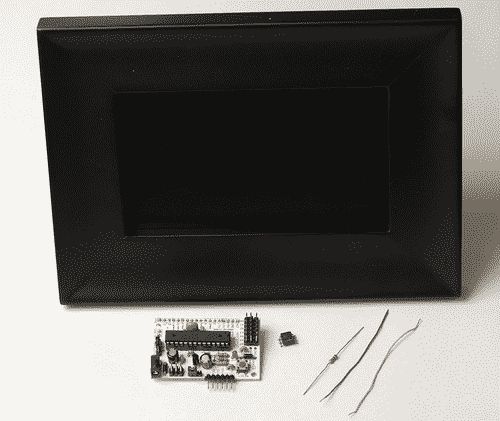

# 基于相框时钟的创意

> 原文：<https://hackaday.com/2010/01/23/ideas-based-on-photo-frame-clock/>

[Mahto]买了一个数码相框，但图像质量很差。他决定用一种独特的方式把它变成一个时钟。他加载了 720 张图片，12 小时内每分钟一张。然后，他使用 Arduino 每分钟模拟一次按钮，循环到下一幅图像。

这是一个简单的解决方案，而且行之有效。当我们第一次看到这个的时候，核心黑客的形象在我们的脑海中跳跃。我们想知道是否有办法将图像数据注入框架的内存？重写存储当前显示的图像文件的 SD 卡位置，然后让相框重新加载图片，怎么样？这些是为一个下雪的周末准备的项目，但我们确信[Mahto]在我们之前很久就完成了这项工作，因为他保持了简单性。

迟早我们会需要一个类别来容纳所有的[时钟](http://hackaday.com/2010/01/16/volt-meter-clock/) [黑客](http://hackaday.com/2010/01/18/the-most-complicated-and-simplest-binary-clocks/)。

[感谢无人机]