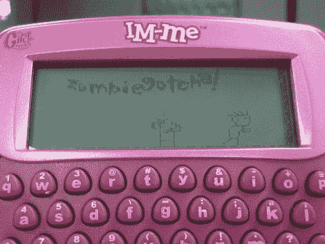

# 使用精灵的即时消息图形操作

> 原文：<https://hackaday.com/2010/11/01/im-me-graphic-manipulation-using-sprites/>

这里有一份由特拉维斯·古斯比整理的关于精灵动画的研究。他正在使用他最喜欢的东西之一，粉色的即时通讯设备[，他已经在上面黑了一段时间了](http://hackaday.com/2010/10/09/pulling-data-from-the-im-me-spectrum-analyzer/)。但是，如果你没有这种硬件，不应该让你气馁。从他的方法中可以学到很多东西，这些方法将转化为任何与图形 LCD 一起工作的微控制器。

他从一个 24 位的 PNM 精灵开始，其中包括他想要的动画的三帧。从那时起，他需要一种方法来存储数据，以供 8 位微控制器使用。他选择编写一个 Perl 脚本，将图像格式转换成 1 位映射。动画的每一帧占用的列宽是 8 的倍数，以便于处理器检索。这种 C 数组的转换以及将它转换为帧缓冲区数据的代码是动画过程的关键。他在射击什么？手持设备上基于精灵的视频游戏。