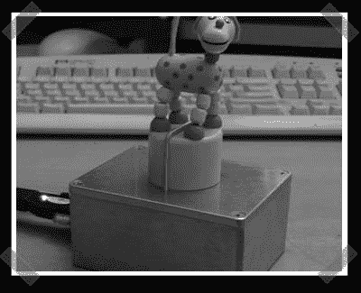

# IM 系列木偶

> 原文：<https://hackaday.com/2006/12/18/im-serial-puppet/>

【皮埃尔-菲利普】派出他的[即时信使 USB 傀儡](http://users.skynet.be/ppc/push_puppet_toy/)。有点傻，但是我喜欢。木偶伺服系统由 pic 控制器和 max232 串行/ttl 转换器驱动。有趣的是，它响应人们进出 gaim 或 xchat。

*   [永久链接](http://users.skynet.be/ppc/push_puppet_toy/)