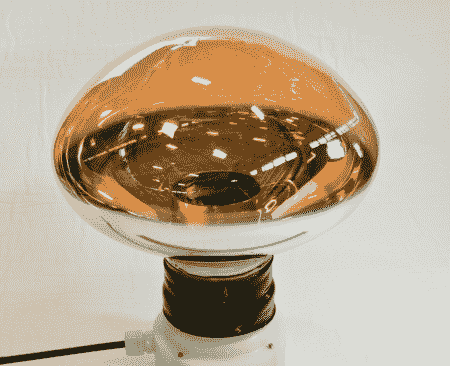

# 科学用内爆真空管

> 原文：<https://hackaday.com/2011/02/10/imploding-vacuum-tubes-for-science/>

布鲁克海文国家实验室的研究人员正在寻找一种加固光电倍增管的方法。为了制造更耐用的管子，研究人员决定先观察管子是如何损坏的是个好主意。所以他们得到了一个旧的鱼雷测试舱，砸碎了里面的灯泡。休息后请继续收看一些高 fps 灯泡粉碎。

光电倍增管被大量用于探测非常难以捉摸的中微子粒子。问题是，当你有 50，000 个光电倍增管浸没在加压水中时，仅仅一个灯泡的崩溃就能引起冲击波的破坏。这就是 2001 年在日本发生的事情，一名维修工人不知不觉地损坏了 11000 个灯泡阵列中的一个灯泡。当油箱被重新加压时，一个受损的灯泡就让他们损失了 7000 多个。

[通过[连线](http://www.wired.com/wiredscience/2011/02/neutrino-photomultiplier-tubes)