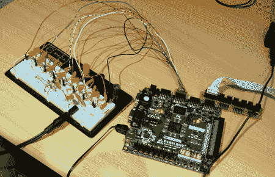

# 改进的 FPGA 合成器

> 原文：<https://hackaday.com/2011/07/10/improved-fpga-synth/>

大约一周前，我们推出了 FPGA MIDI 接口。从那以后，这位构建者疯狂地使用他的 FPGA，修改了他的代码[包括复音和 PWM 输出](http://michhimself.com/blog/fpga-midi-synth-update-midi-improvements-polyphony-pwm-etc/)，并发布了一个[复音演示](http://www.youtube.com/watch?v=b5I7DF9d6Ks)。

在我们之前的报道中，合成器是单声道的，MIDI 的实现很不稳定。在意识到困难的工作已经完成后，[Mich]重新编写了 MIDI 解释模块以在内存中保存 8 个声音。现在，合成器可以以每分钟 999 转的速度弹奏第 16 个音符琶音。

最初的构建使用 8 个引脚来输出音频，带有用于数模转换器的 [R/2R 梯形](http://michhimself.com/blog/content/DSCN5529.jpg)。这对于复音合成器来说效果不好(一切都被削波或有噪声)，所以[Mich]转向 PWM 输出。

[Mich]计划为 PWM 混频器电路构建 PCB，并增加从序列器接收速度数据的能力。他还考虑在构建中添加一个采样器，但是不太确定实现它的最佳方式。如果你对[Mich]有什么想法，请在评论中留给他。查看下面的视频，观看 FPGA synth 播放*爆米花*的演示。

[https://www.youtube.com/embed/9F9AvosC6R8?version=3&rel=1&showsearch=0&showinfo=1&iv_load_policy=1&fs=1&hl=en-US&autohide=2&wmode=transparent](https://www.youtube.com/embed/9F9AvosC6R8?version=3&rel=1&showsearch=0&showinfo=1&iv_load_policy=1&fs=1&hl=en-US&autohide=2&wmode=transparent)