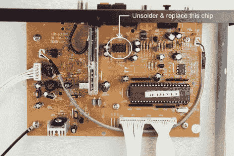

# 改善高清收音机的音频输出

> 原文：<https://hackaday.com/2011/07/29/improving-audio-output-from-an-hd-radio-receiver/>

[Phil]在 Radio Shack 以 60%的折扣清仓时买了一个高清收音机。但令他失望的是，当他把它连接起来时，声音仍然有很多不足之处，只有有限的中音和扁平的低音。经过一些论坛挖掘，他发现光学输出没有这个问题，并得出结论，驱动模拟音频输出插孔的运算放大器需要一些调整。他没有拿到电路板的原理图，但采纳了一些老式设备专家的建议，用棕褐色的 OPA2604AP 芯片替换了原有的 ic。

这修复了问题，而没有对硬件进行任何其他调整。但当他在那里时，他还将外部天线连接器插孔固定到机箱上，以便进行更好的测量。

如果你想知道设备的细节，[菲尔]正在黑一个 Auvio 高清收音机调谐器。但他也提到，百思买销售的 Insignia NS-HDTUNE 可能受益于相同的修改。