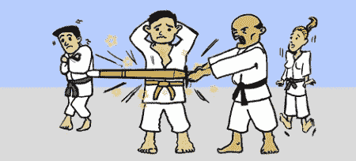

# 使用 Kinect 提高运动成绩

> 原文：<https://hackaday.com/2011/10/14/improving-sports-performance-with-a-kinect/>

作为一名刚毕业的机甲战士，[亚历山德罗·蒂米]对移动身体很了解。他的论文“虚拟老师”旨在量化这些动作，以便更好地指导和训练武术。

虚拟唤醒在训练中使用 Kinect 进行动作捕捉。从那里，Kinect 记录的骨骼进行了一点点处理，并计算出拳头的速度。查看[演示视频](http://www.youtube.com/watch?v=g3pgnOunLac)以更好地解释虚拟唤醒可以做什么。

考虑到需要精确调整骨骼和特定动作时间的运动数量，我们认为这可能是让 Kinect 进入野外的突破(非视频游戏)应用程序。高尔夫专业人士喜欢记录学生的挥杆动作，以确保他们的肩膀对齐。

我们见过的大多数 Kinect 黑客要么是由几个 [3D 扫描仪](http://hackaday.com/2011/08/10/kinect-based-turntable-3d-scanner-looks-very-promising/)和[虚拟衣柜](http://hackaday.com/2011/07/07/play-dress-up-with-kinect/)组成的[机器人](http://hackaday.com/2011/08/23/kinect-controlled-delta-robot-has-a-magnetic-personality/)。虚拟唤醒是一个相当令人印象深刻的软件，加上一些额外的运动可以大赚一笔。

请查看下面令人毛骨悚然的动画常见问题解答和演示视频。

[https://www.youtube.com/embed/dsirrQ_PMcc?version=3&rel=1&showsearch=0&showinfo=1&iv_load_policy=1&fs=1&hl=en-US&autohide=2&wmode=transparent](https://www.youtube.com/embed/dsirrQ_PMcc?version=3&rel=1&showsearch=0&showinfo=1&iv_load_policy=1&fs=1&hl=en-US&autohide=2&wmode=transparent) [https://www.youtube.com/embed/g3pgnOunLac?version=3&rel=1&showsearch=0&showinfo=1&iv_load_policy=1&fs=1&hl=en-US&autohide=2&wmode=transparent](https://www.youtube.com/embed/g3pgnOunLac?version=3&rel=1&showsearch=0&showinfo=1&iv_load_policy=1&fs=1&hl=en-US&autohide=2&wmode=transparent)