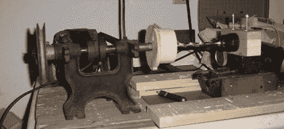

# 简易金属车床

> 原文：<https://hackaday.com/2011/09/25/improvised-metal-lathe/>

[McKGyver]需要制造一些零件。他没有走正常的路线——找机床朋友或付钱给机械商店,[而是临时制作了一台简单的金属车床](http://mckgyver.pbworks.com/w/page/20654165/MetalLathe)。

[如](http://hackaday.com/2011/09/15/solar-powered-reprap-prints-even-when-the-power-is-out/) [多](http://hackaday.com/2011/09/08/huge-diy-3d-printer-predictably-prints-huge-3d-items/) [如](http://hackaday.com/2011/09/04/delta-robot-3d-printer/) [我们](http://hackaday.com/2011/09/09/laser-etched-pcb-production/) [爱](http://hackaday.com/2011/07/12/re-manufacturing-inkjet-cartridges-for-3d-printing/) [3D 打印机](http://hackaday.com/2011/06/25/selective-solar-sintering-with-sand/)，它们不是万能的、万能的解决方案。有时候，你需要变得脏一点，用老办法来做。[McKGyver]需要一种方法来生产铝联轴器，以连接步进电机和丝杠。主轴箱使用的是 20 世纪 40 年代的砂轮。由于[McKGyver]只需要一种尺寸的连接器，他用木头做了一个夹具，将铝片固定在主轴上。一个钻头和一个来自照片放大机的对焦器组成了简易车床的尾座。相机对焦器的使用相当巧妙。除非设备已经损坏，否则它保证沿直线运动。一束小激光被用来对准钻头。

成品耦合器的同心度为 0.005 英寸。对他的应用来说，这是一个“可接受的精度”,一个不需要移动一千磅重的南弯车床的巧妙构建。