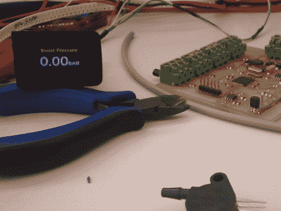

# 汽车仪表板的按钮显示

> 原文：<https://hackaday.com/2010/11/15/in-button-display-for-your-cars-dashboard/>

这里有一个关于增加汽车仪表板的有趣的例子。[Daniel]正在他的捷达中使用一个按钮坯料来安装一个 [1”有机发光二极管显示器。它显示辅助数据，如增压压力和几组温度读数。显示器本身有一个很小的电路板，由 PIC 24 驱动。一个更大的电路板，如上所示，收集来自一些传感器的温度数据，这些传感器是[丹尼尔]作为黑客的一部分添加的。有一些安装在深色车内的显示器的图片，看起来很容易阅读。听起来固件中还内置了一些调光功能。这是我们见过的给你的仪表板添加显示器的最简单的方法，因为它只需要你弹出一个空白按钮，而不是拆卸整个控制台或](http://www.carforums.co.za/viewtopic.php?f=3&t=27040)[接入已经存在的](http://hackaday.com/2010/04/16/hijacking-the-mazda-lcd-display/)。