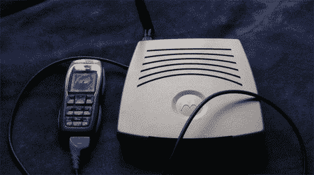

# 车载无线网络

> 原文：<https://hackaday.com/2008/06/26/in-car-wifi/>

你可能已经听说，克莱斯勒正计划为其车辆提供[车载无线互联网接入](http://www.washingtonpost.com/wp-dyn/content/article/2008/03/19/AR2008031903447.html#)。如果没有，预计今年晚些时候当必备硬件成为销售场所的选项时，或者明年当它成为一些汽车的工厂标准时，会听到更多关于它的消息。

我们不能说这是个坏主意，只是这不是个新主意。市面上有很多商用便携式路由器，但它们仍然需要调制解调器和数据套餐来提供互联网接入。对于互联网接入和无线路由，看看[【内特·真】的手机路由器组合](http://devices.natetrue.com/mobileap/)，它使用一部备用的诺基亚手机和一个运行 OpenWRT 的高度改进的 Wi-Fi 路由器。[True]通过提供说明和必要的自定义代码使它变得简单，但是对于相对较慢的连接来说，这似乎是一项很大的工作。我们认为最初的[踏脚转盘](http://www.stompboxnetworks.com/buildit.html)仍然是最有趣的，因为它有商业设备的速度和开放的 x86 操作系统可以修改。

*   [永久链接](http://www.washingtonpost.com/wp-dyn/content/article/2008/03/19/AR2008031903447.html#)