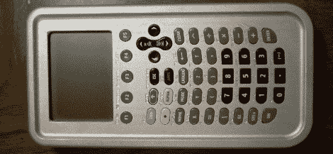
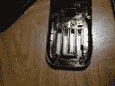
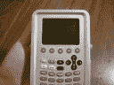
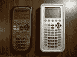

# 坚不可摧的 TI-89

> 原文：<https://hackaday.com/2010/08/23/indestructible-ti-89/>

有时，昂贵的计算器会掉到地板上。几乎所有拥有 TI 或惠普图形计算器的人都会遇到这种情况。遗憾的是，它们并不总是反弹。在这种情况发生在爱荷华大学的工业工程学生[Howard C.]身上后，他决定花 50 美元用铝制成自己的替换外壳，而不是在一个坏掉的电池盒上扔掉设备。[Howard]选择把这个故事发给我们，而不是写他自己的博客，所以我们把休息后他发给我们的所有精彩图片都收录进来了。

