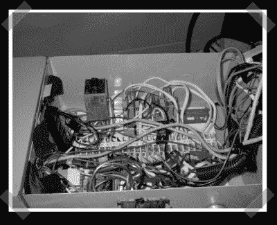

# 工业闹钟

> 原文：<https://hackaday.com/2007/05/02/industrial-alarm-clock/>

在[闹钟](http://www.nandahome.com/products.clocky.html)从你身边跑开的同时，[这个](http://www.endofnet.com/idc.html)闹钟大概还能还手。它有一对基本的印记和继电器来控制外部设备。[Jason]用他已经拥有的零件建造了它，并设想它以后用于舞台特效控制。现在，我敢打赌，没有一个客人会因为害怕时钟的报复而试图关掉它。

*   [永久链接](http://www.endofnet.com/idc.html)