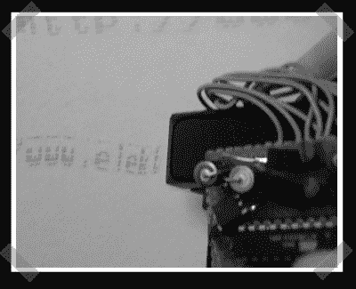

# inker–手动喷墨

> 原文：<https://hackaday.com/2006/10/08/inker-the-hand-inkjet/>

【Sprite _ TM】是我们最喜欢的黑客之一，当他[在](http://www.spritesmods.com/?art=inker)发来这个消息时，我很开心。他为惠普喷墨墨盒构建了一个驱动电路，使他能够用手打印。非常适合打印在其他人的白板或啤酒上。他必须做一些黑盒逆向工程来弄清楚板载驱动芯片在墨盒上做什么。考虑到任务，电路出奇的简单。它有一些 ATTINY 大脑，一些驱动晶体管，一条数据总线和一个 DC/DC 功率转换器，以获得所需的 ~~1.21 吉瓦~~，呃 20 伏来驱动墨盒。

*   [永久链接](http://www.spritesmods.com/?art=inker)