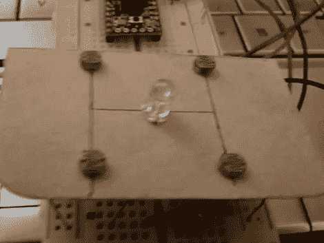

# 使用发光二极管和四个光敏电阻的输入设备

> 原文：<https://hackaday.com/2010/09/22/input-device-using-led-and-four-photoresistors/>

【朱利安】造了[一个输入设备，利用一些光敏电阻](http://www.youtube.com/watch?v=5BfCcuIaVY0)检测到的反射光。将你的手放在设备上方会将 LED 发出的光反射到硫化镉传感器上。这些传感器的电阻由 Teensy 微控制器上的四个 ADC 引脚读取，并转化为鼠标的移动。在休息后的视频中，你可以看到这在控制光标方面非常有效。[的源代码可以在 pastebin](http://pastebin.com/H3kzkbK2) 上获得，但我们也将为子孙后代托管[的代码。](http://blog.mahalo.com/hackaday/misc/teensy-mouse-code.c)

[https://www.youtube.com/embed/5BfCcuIaVY0?version=3&rel=1&showsearch=0&showinfo=1&iv_load_policy=1&fs=1&hl=en-US&autohide=2&wmode=transparent](https://www.youtube.com/embed/5BfCcuIaVY0?version=3&rel=1&showsearch=0&showinfo=1&iv_load_policy=1&fs=1&hl=en-US&autohide=2&wmode=transparent)

[谢谢帕特里克]