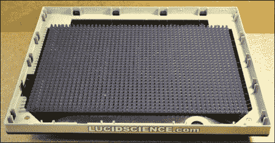

# 疯狂的隐蔽红外照明

> 原文：<https://hackaday.com/2011/01/31/insane-covert-ir-illumination/>

lucidscience 的[Onironaut]给我们发来了他最新项目的链接，[一些红外照明面板](http://lucidscience.com/pro-led%20array%20illuminator-1.aspx)。起初，我们被他一贯的高水准摄影和描述所吸引。不过这只是一排发光二极管。尽管如此，我们还是不停地点击“下一页”按钮，因为他讲得太详细了。然后我们看到了版本二。他不是简单地将红外发光二极管阵列安装在他的安全摄像机外部，而是在一个旧的平板显示器内部安装了 1536 个红外发光二极管。这是一个假显示器产生 180 瓦的红外光，我们认为这甚至是一半的功率！他把显示屏换成了单向镜，所以你不会知道这不是放在他桌子上的普通屏幕。像往常一样做得很好。