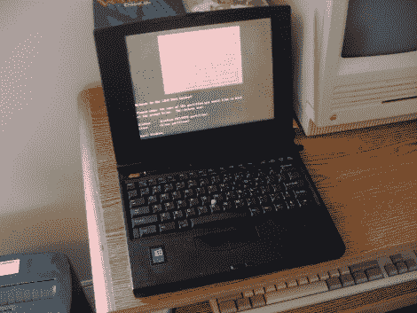
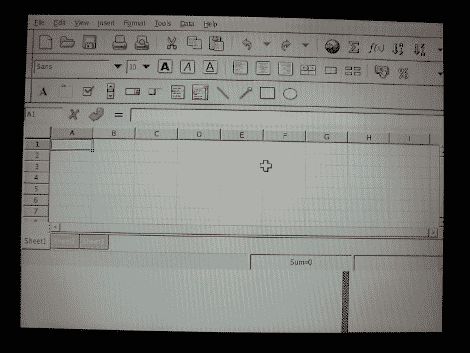

# 在旧 PC 上安装 Linux 第 2 部分

> 原文：<https://hackaday.com/2011/08/19/installing-linux-on-old-pcs-part-2/>

在第一部分中，我向您展示了您可以在一台新计算机上安装一个 [linux 发行版，并在短时间内毫不费力地将其移植到 386](http://hackaday.com/2011/08/12/installing-linux-on-a-386-laptop/) 计算机上。现在是时候转向更大更强的机器了，比如 486、奔腾和更好的。

我将根据安装的内存把这个快速教程分成几个部分。虽然这不会成为世界上所有旧电脑的“指南”,但我希望至少能给你指明正确的方向。我将提到几个主要针对超低 ram 机器的发行版。我无意挑起一场分配战，我也没有亲自与每一个人坐下来进行有根据的评估。然而，我们非常欢迎你加入进来。

休息后加入我们，看看你对壁橱里的旧“船锚”有什么选择！

**小于 16 兆内存:**

这就是我的第二台笔记本电脑的用武之地。这是一个旧的第一次运行奔腾运行在 90 兆赫与 8 兆内存。在内存小于 16 兆的机器上，没有太多选择。

与 386 安装非常相似，您可以使用较旧的发行版，但是您确实有几个其他选项。一个是 DSL linux，在其社区之外不再被支持。还有一个是 [Deli linux](http://deli.tavvva.net/) ，也是已经不支持了，但是有一个分叉叫精致。由于 precious 没有安装程序，所以需要先安装 precious 8，然后通过包管理器升级。

精致和它的分支有 2.4 内核，这对于现代应用程序来说还是相当新的。它将在 4 兆的机器上启动，如果你摆弄交换空间，你甚至可以直接安装在你的目标硬件上。

由于我的旧笔记本电脑没有光盘驱动器或功能软盘，我把硬盘放在我的台式电脑，并从光盘启动安装程序。只有 8 兆内存，我可以让 Xwindows 正常运行，但是任何活动和系统都会变成一个交换僵尸。

(大约半小时后，这里是 gnumeric)

netBSD 应该使用 8g 的 ram，尽管每次我尝试这样做时，它都会在目标机器上启动时锁定。

**16 到 32 兆内存:**

同上，除了你将有一个更好的时间运行 Xwindows 和 windows 管理器。同样，你可以运行一个旧的主流发行版，也可以运行 deli。

如果你想要最新的软件，世界上的 BSD 在这些机器上应该也能很好地工作。

**重量级，48 兆或更大的内存:**

如果你的机器有 48 兆或更多的内存，你就很容易做到。从现在开始，几乎所有的发行版都可以顺利启动和运行。你选择哪种发行版完全取决于你的机器的能力。例如，一个轻量级的 ubuntu remix 应该可以在奔腾 3 上很好地运行，但是你可能不想在你的奔腾 MMX 上运行它。

我在过去有幸接触到的一些标准发行版包括:Debian、Slackware、Tiny Core、gentoo、puppy 等等。如果你想要一个已经安装了现代有用应用程序的光盘发行版，你可能想看看[connachetos](http://www.connochaetos.org/wiki/)或 [slitaz](http://www.slitaz.org/en/) ，它们在 80MB 或 128MB 内存中运行良好。

如果你不能从软盘或光盘启动，大多数发行版仍然允许硬盘安装和网络安装。在最坏的情况下，你只需将你的目标驱动器插入一台更现代的机器，从 cd 或 u 盘安装即可。

我希望这能帮助你的旧机器找到第二个风。我们很想看看他们。如果你已经重新使用了旧的船锚，并在上面运行了 linux，请在 [fourms](http://forums.hackaday.com/) 中与我们分享！

感谢阅读和快乐的复古计算。