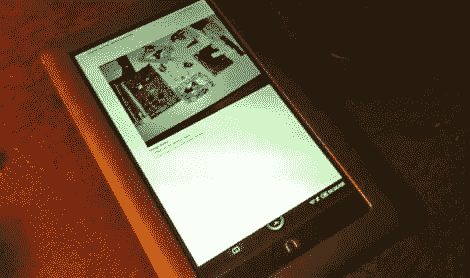

# 指令“黑客版”

> 原文：<https://hackaday.com/2010/12/20/instructables-hackaday-edition/>

我们从 Instructables 的所有者[埃里克·威尔海姆]那里收到了一封令人愉快的信。他想以 EPUB 的形式拍摄一些我们在 2010 年最后一个季度联系过的项目，以此向我们的方向表达善意。这些都是无广告的，包括所有的图片。你可以下载它，并在你选择的电子阅读器上观看，甚至可以在你的浏览器上用[合适的插件](https://addons.mozilla.org/en-US/firefox/addon/45281/)观看。这些视频仍然链接到 Instructables，但他认为我们的读者可能会喜欢没有广告的体验。他说这种联系应该可以持续一个月左右。

对于那些真正想要免费内容并愿意付费的人来说，instructables 已经推出了一些出版物，这些出版物是 Instructables 在某些主题上的集合。例如，[Eric]指出他们已经编译了一些我们可能感兴趣的内容，如“[通过微控制器更好地生活](http://itunes.apple.com/us/book/better-living-through-microcontrollers/id409040573?mt=11)”和“[令人惊叹的 led 项目](http://itunes.apple.com/us/book/amazing-led-projects/id408985449?mt=11)”。事实上，有一堆标题，看起来有些也是免费的。

谢谢[Eric]，我确信你的行为赢得了一点尊重，即使是那些因为广告和注册而不喜欢 Instructables 的人。