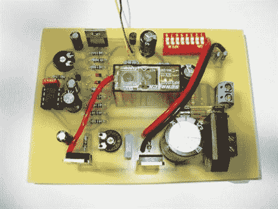

# 智能电池充电

> 原文：<https://hackaday.com/2010/06/11/intelligent-battery-charging/>

[Razor]与我们分享了智能电池充电电路的计划。这款手机不会盲目地给电池充电，而是在电池充满电后自动关机。这是一个很好的清洁电路，可以通过一些微调电位计和 dip 开关根据您的具体需求进行调整和微调。

[via [HackedGadgets](http://hackedgadgets.com/2010/06/10/automatic-battery-charger-project/)