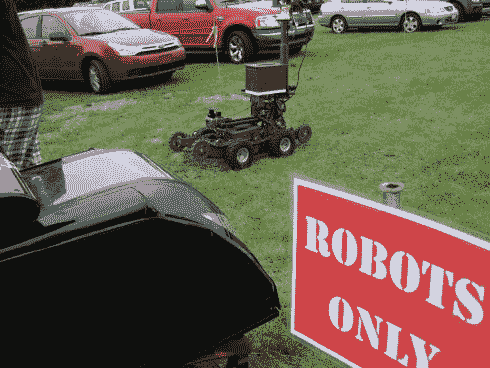
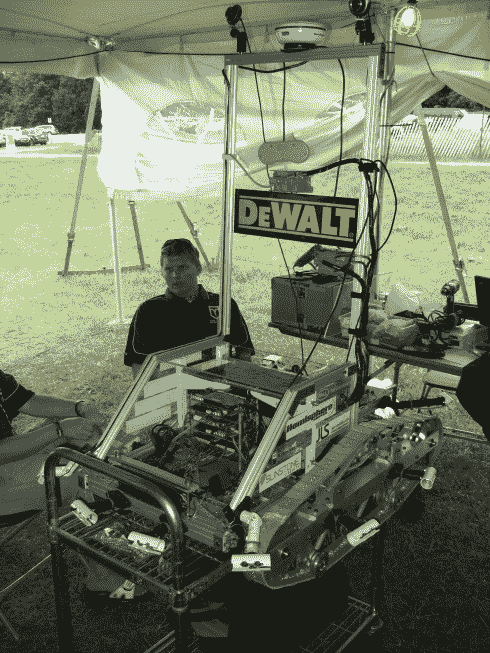
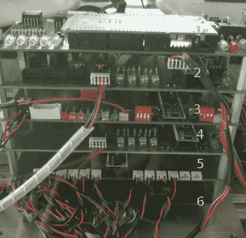
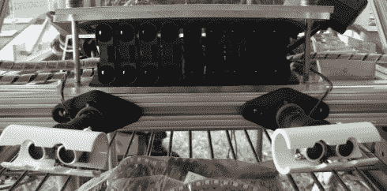
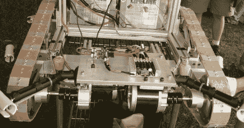
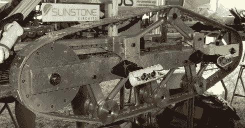

# 2010 年智能地面车辆竞赛第一天报告

> 原文：<https://hackaday.com/2010/06/05/intelligent-ground-vehicle-competition-2010-day-one-report/>

智能地面车辆竞赛( [IGVC](http://www.igvc.org/ "IGVC Website") )是 DARPA 大挑战赛的前身，在很多方面都一样困难。我们很荣幸能与田纳西科技大学自主机器人团队一起参加今年的比赛。参加比赛的团队实现了一些令人惊叹的自制机器人，所以我们决定在比赛的每一天做一个简短的部分，介绍一些示范性的机器人黑客技术。

今天的机器人来自宾夕法尼亚州的约克学院。这个被称为“绿色闪电”的机器人拥有一套令人印象深刻的定制硬件。

我们采访了这个团队，并在跳跃后用图片对他们的机器人做了一个相当全面的概述。

机器人的脊髓是这种定制的美。

它由六层组成，每层都有特定的功能。这些电路板由团队设计，由 [Sunstone Circuits](http://www.sunstone.com/) 制造。除了顶层，每一层都有自己的 [teensy++](http://www.pjrc.com/teensy/) 单元，用 C 编程，提供一个 SPI 接口给它要连接的硬件。第一层有一个用 C 语言编程的 Arduino Mega。这些层通过以 500k 波特运行的 SPI 总线与 Mega 通信。Mega 处理信息，然后通过 1 兆波特 usb 串行连接与计算机通信。

剩下的五层每一层都被设计成与机器人硬件的特定部分接口。第二层与 Nubotics 的[车轮指挥器通信，简化机器人的运动控制。第三层是机器人紧急停止的接口。规则要求在机器人的背面有一个可见的硬件紧急制动和一个无线远程紧急制动。他们通过这一层连接到机器人的 zig-bee 模块解决了他们的无线 e-stop 问题。](http://www.acroname.com/robotics/parts/R279-WC-132.html)

第四、第五和第六层都连接到机器人的传感器组。第四层是安装在机器人顶部的 gps 接口。大多数 gps 单元用简单的串行通信，他们设法通过增加一块板来节省一个 usb 端口，这是非常优雅的。机器人有九个 [Sharp 2Y0A710 距离传感器](http://hackaday.com/2009/02/24/parts-analog-distance-sensors-sharp-gp2d122y0a02/)作为避障的短程缓冲器，它们都连接到第五层。最后一层是位于机器人周围罗盘点的 10 个[远程声纳传感器](http://www.parallax.com/Store/Sensors/ObjectDetection/tabid/176/CategoryID/51/List/0/SortField/0/Level/a/ProductID/92/Default.aspx)的接口。

该机器人还在桅杆上安装了两个 USB 网络摄像头，用于线路和物体检测。人工智能和计算机端硬件接口是用 C 和 Java 混合编程的。人工智能遵循一个反应模型，而不是映射/规划模型，这在这场比赛中被证明对许多团队非常有效。

框架、轨道和传动系统也是由该团队定制的。

在这里你可以看到机器人的背面，那里有传动系统、车轮指挥官和两个剑齿虎马达驱动器。

一张侧面照片显示了他们的轨道系统。他们首先在 SolidWorks 中建模，然后在室内制作包括皮带在内的所有东西。

最后，这个机器人在打折后花费了他们大约 5200 美元，考虑到它的能力，这是非常令人印象深刻的，而且这次比赛中的一些机器人很容易就突破了 50000 美元。这是一个好的工程和自制魔法可以实现的最好例子。我们将以他们的手动控制系统的镜头结束。

