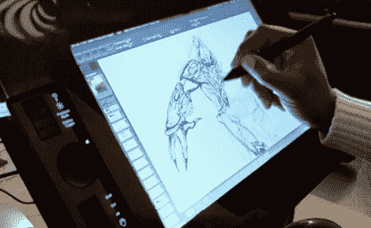

# 密集套件将 Wacom 平板电脑变成 Cintiq 克隆版

> 原文：<https://hackaday.com/2010/03/14/intense-kit-turns-wacom-tablet-into-cintiq-clone/>

[Lesa Wright]刚刚开始销售用于将 Wacom tabet 转换为 Cintiq 克隆产品的外壳[套件。你需要从你自己的 Wacom 平板电脑开始，有四种不同型号的](http://www.tabletmod.com/)的[套件。你还需要](http://www.tabletmod.com/Products.html)[找到一些其他部件](http://www.tabletmod.com/Extras.html):一个兼容的笔记本电脑液晶显示屏、控制器套件和一些电缆延长线。从那里开始，套件接管，几片激光切割的丙烯酸需要正确地粘合在一起，然后为了安装所有东西，需要从泡沫板上切割出数量惊人的垫片..

这些套件售价约为 225 美元。这可能看起来有点贵，因为你需要带自己的电子产品参加聚会，但你有没有查看过原版 Cintiq 的价格？你可以期望在一个现成的模型上丢下大约 1200 块骨头。在你潜水之前，你应该[看看他们收集的组装视频](http://www.tabletmod.com/HowTos.html)，这是一个相当的过程。