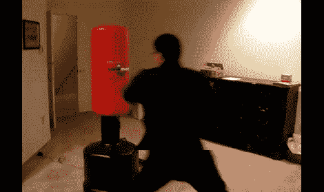

# 交互式出气筒

> 原文：<https://hackaday.com/2011/03/10/interactive-punching-bag/>

如果你需要一个陪练，并且不想依赖于在任何随机时间找到一个愿意合作的伙伴，那么这个[互动出气筒](http://www.liorelazary.com/index.php?option=com_content&view=article&id=34:interactive-punching-bag&catid=12:karate&Itemid=6)可能会让你感兴趣。[Lior]已经学习了一段时间的空手道，最初设想的是使用德州仪器的 Chronos 或微软的 Kinect 作为输入，一个机器人手臂可以向你出拳，尽管在经过一些初步的折腾后，他决定放弃这个计划，并认为“在出气筒中放置一些 led 并使用 Arduino 感知一些力有多难？”

在大约一天半的时间里，他使用了商店里的零件，并去了一趟 radio shack，完成了他的目标，并为将来的扩展留下了一些空间。该包目前具有 3 个电阻传感器，3 个 LED，并使用笔记本电脑进行反馈，尽管液晶显示器正在路上。扩展室允许 3 个以上的传感器和 LED 的两倍的行动和更复杂的游戏。

说到游戏，拳击袋目前有 3 个不同的锻炼程序，在 30 秒模式下尽可能多的出拳，一个可编程的序列模式，以及随机的偶尔出拳。休息后加入我们的快速视频，并查看页面的详细信息和一堆图片。

[https://www.youtube.com/embed/ADbubYBdMqQ?version=3&rel=1&showsearch=0&showinfo=1&iv_load_policy=1&fs=1&hl=en-US&autohide=2&wmode=transparent](https://www.youtube.com/embed/ADbubYBdMqQ?version=3&rel=1&showsearch=0&showinfo=1&iv_load_policy=1&fs=1&hl=en-US&autohide=2&wmode=transparent)