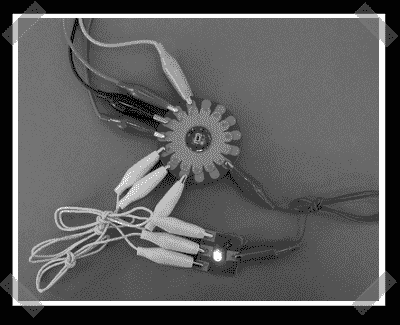

# 交互式纺织品结构

> 原文：<https://hackaday.com/2007/10/02/interactive-textile-construction/>

Leah Buechley 的电子纺织品构建套件由可缝合的传感器和微控制器组成。可缝合是指这些部分可以用针和线缝合到可穿着的衣服或其他基于织物的外壳中。一篇关于电子纺织品构建套件项目的[论文](http://www.cs.colorado.edu/%7Ebuechley/publications/buechley_ISWC_06.pdf) (PDF)包含了第一个版本。电子纺织品构建套件的第二个版本 LilyPad Arduino 将于本月通过 SparkFun 的网站[上市。特别有趣的是](http://www.sparkfun.com/commerce/categories.php?cPath=2_135)[她的指令](http://www.cs.colorado.edu/%7Ebuechley/e-textile_kit/e-textile_kit_tech.html)修改 [Arduino](http://www.arduino.cc/) 的时钟速度，使其适合电池供电的可穿戴设备。

我们已经在 2005 年[两次](http://www.hackaday.com/2005/10/05/wearable-led-display/)报道了【莉亚·布奇利的作品[的可穿戴 led 矩阵作品。](http://forums.hackaday.com/2005/10/07/hackaday-links/)

更新:[Leah]更新了她的网站，因为我们张贴了这个，[添加了这个新的操作方法](http://www.cs.colorado.edu/~buechley/diy/diy_lilypad_arduino.html)。

*   [永久链接](http://www.cs.colorado.edu/%7Ebuechley/e-textile_kit/e-textile_kit_intro.html)