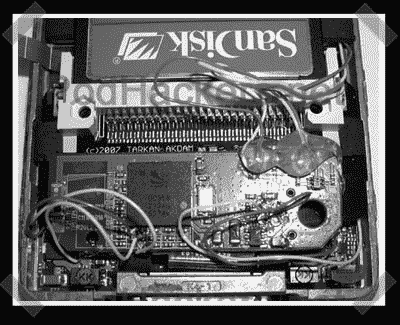

# 第五代 IPods 内置蓝牙

> 原文：<https://hackaday.com/2008/02/21/internal-bluetooth-for-5th-gen-ipods/>

【Ed】发来了他的[最新](http://www.ipodhackers.net/) iPod 改装成果。之前他在第四代[上做了这个，现在他又推出了第五代版本。他为 mod 找到了一个更小的蓝牙模块，但如果你想保留原来的后盖，需要用一个紧凑型闪存卡取代硬盘，以便在外壳内腾出空间。](http://www.instructables.com/id/Add-INTERNAL-Bluetooth-Capability-To-Your-iPod/)

*   [永久链接](http://www.ipodhackers.net/)