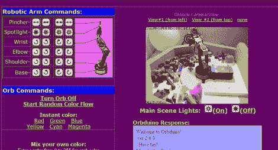

# 互联网控制的机器人手臂

> 原文：<https://hackaday.com/2011/04/21/internet-controlled-robotic-arm/>

[Trav]正在思考虚拟现实，并决定它不再是人们吹捧的那样，所以他创造了一种他称之为“远程现实”的体验。虽然这些年来我们已经看到了许多允许人们与全球各地的物体进行远程交互的装置，但他的 Orbduino 项目不仅仅是简单地开关灯(尽管他也允许你这样做)。

在他的房子里，他建立了一个机器人游乐场，任何来访的人都有机会玩他安装在那里的机械臂。手臂位于一个装满随机物品的围栏中，这些物品可以堆叠和移动。他还承诺向你展示一些有趣的东西，前提是你可以引导手臂捡起一个物体，并将其放在围栏外的目标上。

他也没有忘记强制性的远程灯光控制。你可以打开和关闭头顶上的灯，也可以控制房间角落里的彩色球体。该项目的大部分界面是由 Arduino Mega 完成的，它处理机器人手臂界面，并处理灯光装置。

如果你有时间，可以去他的网站，试一试机器人手臂。这是一个有趣的小时间浪费，你可能会喜欢。只要确保在他的网络服务器上放松就行了！