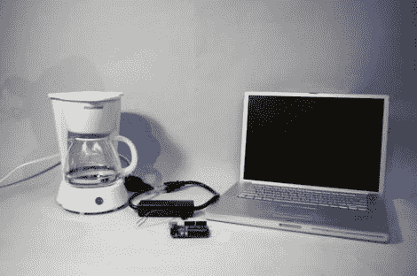

# 互联网支持的滴滤咖啡

> 原文：<https://hackaday.com/2011/01/07/internet-enabled-drip-coffee/>

一壶新鲜的咖啡永远不会比 tweet 更远。它的工作方式和[我们的巨魔嗅鼠](http://hackaday.com/2010/12/19/hackaday-unleashes-a-troll-sniffing-rat/)差不多。在那个构建中，我们使用 Python 脚本来监控我们的评论，除了脚本通过 Twitter API 读取 tweets 之外，这也做了同样的事情。它会寻找一个特定的散列标签(#driptwit)，当找到时，它会向 Arduino 发送一个串行命令。然后，微控制器将数字引脚写入高电平，以启动继电器，为咖啡机供电。

当然，你必须在壶中预装咖啡渣和水，但你还能指望什么呢，自动烘焙咖啡和 T2 冲泡咖啡？那是相当多的工作。