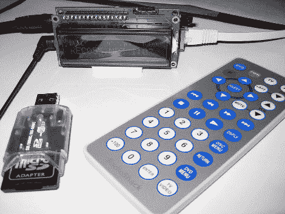

# 网络电台选手赢得螺旋桨设计大赛

> 原文：<https://hackaday.com/2010/04/05/internet-radio-player-wins-propeller-design-contest/>

它有一个网卡，一个遥控器，一个字符显示器，可以录制和播放流媒体音频。桑普是[哈里森·范的] [竞赛获奖的网络电台选手](http://www.parallax.com/Thumper/tabid/848/Default.aspx)。他完成的电路板与 16×2 字符显示器的尺寸大致相同，并使该设备具有较小的外形。它可以通过红外遥控器或远程网络界面进行控制。源文件可以通过顶部的链接获得，但是真正有趣的细节包含在令人震惊的全面的 [PDF 文档](http://www.parallax.com/portals/0/downloads/contest/prop0910/ThumperFullReport.pdf)中。

上面这张照片有点误导。尽管显示了 USB 读卡器，但主板背面有一个微型 SD 插槽。这个项目将需要 [USB 主机控制器的螺旋桨芯片](http://hackaday.com/2010/04/05/usb-host-for-propeller-micros/)为了使用该阅读器。一旦你看完这个，别忘了看看[的其他参赛作品](http://www.parallax.com/tabid/846/Default.aspx)。

[感谢无人机]