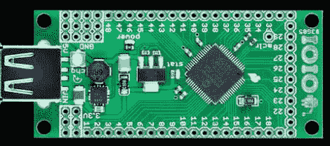

# i.o.i.o .升级变得更加容易

> 原文：<https://hackaday.com/2011/07/13/ioio-upgrades-get-a-bit-easier/>

IOIO 是 Android 手机的分线板，早于 Android 开发者套件硬件，现在升级起来稍微容易一些。这是因为[Ytai 的 IOIO manager 应用程序只是他的 Android market。骄傲地坐在主板顶部的 PIC24F 一直运行着引导加载程序，但出于安全原因，它被编程为只与官方签署的应用程序对话。现在有一个应用程序符合这个条件，你可以从你的手机升级固件，而不需要外部程序员。

bootloader 本身呢？当然，随着时间的推移，这需要升级，对不对？嗯，是的。[Ytai 的]今天的声明还提供了升级引导程序的选项，但有一个警告。你需要两块 IOIO 板来完成升级。一个连接到电话，成为一名程序员，而另一个则悠闲地等待刷新代码。