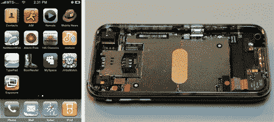

# IPhone: 2.0 固件越狱，3G 解体

> 原文：<https://hackaday.com/2008/07/10/iphone-20-firmware-jailbroken-3g-taken-apart/>

哦，iPhone 开发团队，你们真逗。这并不是说你在 iPhone 2.0 固件发布的当天成功[破解了它，尽管我们对此忍不住傻笑。你甚至没有以开玩笑的方式展示你的作品。我们只是喜欢你熟练地用一些随意的图片和一些冷漠的话让我们为新的越狱安装程序而疯狂。请在我们变得焦躁不安之前给我们安装程序。](http://blog.iphone-dev.org/post/41730121/living-in-sweet-harmony)

不过，iFixit 发布了一个完整的 iPhone 3G 拆卸图，揭开了光滑的外壳，尽情享受内部的美好。他们发现上一个型号有一些有趣的变化:例如，玻璃屏幕不再粘在 LCD 上，这无疑会降低维修成本。电池也是未售出的，这意味着如果唯一的电池需要维护，你就不必将手机送去维修。

*   [永久链接](http://blog.iphone-dev.org/post/41730121/living-in-sweet-harmony)