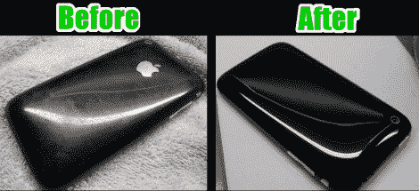

# IPhone 外壳修复

> 原文：<https://hackaday.com/2010/03/03/iphone-case-rehabilitation/>

(理查德·卡布雷拉的)iPhone 因多年使用而被划伤。苹果产品的吸引力很大一部分是伴随而来的性感，所以他开始补救这种令人厌恶的东西。他的 [iPhone 外壳修复](http://forums.macrumors.com/showthread.php?t=871308)指南带你经历奇迹般的转变。他使用的工具之一是 3M 公司的头灯透镜修复套件，因为它的抛光垫包括从粗糙打磨到抛光的渐变粒度。正如你所看到的，标志和文字已经被磨掉，但这是一个看起来像一个闪亮的新设备的小代价。