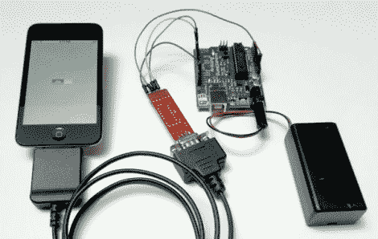

# IPhone 到 Arduino 通信无越狱

> 原文：<https://hackaday.com/2011/07/18/iphone-to-arduino-communications-sans-jailbreak/>

当谷歌发布他们的 ADK 允许 Android 智能手机与基于 Arduino 的设备交互时，我们确信至少有一两个 iPhone 用户感到被忽视了。多亏了 Redpark 的人们，那些人现在可以与 Arduino 互动，而不必破解他们的手机。

对于任何希望进行任何 iPhone/Arduino 交互的人来说，这是一件好事——除了价格。30 针串行电缆目前售价 59 美元，老实说，这对我们来说太贵了。当我们第一次看到这个消息时，我们最初的想法是，我们很快就会看到一个开源版本。

不幸的是，这个想法是短暂的，因为我们很快就想起了苹果的 MFI 项目。如果你不熟悉，MFI(又名为 iStuff 制造)程序通过许可费和一大堆法律协议限制了可以连接到 iDevice 的内容。虽然我们不会很快拿起这个加密狗，但如果有人对那些讨厌的 MFI 芯片做了任何逆向工程，我们会洗耳恭听。