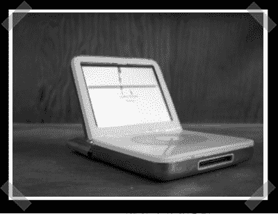

# IPod 笔记本电脑又名 ITop(带两个)

> 原文：<https://hackaday.com/2007/06/03/ipod-laptop-aka-itop-take-two/>

这次不是【本·赫克】。[欧文]送来了他的[改装的](http://web.mac.com/owenmcgarry/iWeb/Downloads/Downloads/10E5A5E6-7AE6-4BFD-B454-11CBC427A9A1.html) iPod。一旦保修因破损而失效，他决定确保它真的失效。折叠受到电线长度的限制——但我无法从描述或图片中看出他是否真的用铰链连接了它。

更新:由于一些古怪的 cms 错误，我重新发布了这篇文章…

*   [永久链接](http://web.mac.com/owenmcgarry/iWeb/Downloads/Downloads/10E5A5E6-7AE6-4BFD-B454-11CBC427A9A1.html)