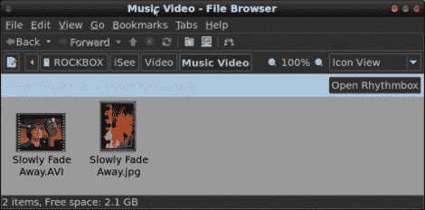

# IPod 外设:ISee360i 黑客

> 原文：<https://hackaday.com/2010/01/16/ipod-peripheral-isee360i-hacking/>

[James]已经完成了一些工作[对 iSee360i 外设](http://biggear.wordpress.com/2010/01/05/cracking-the-isee360i/)的协议进行逆向工程。这个 iPod 插件是一个媒体播放器外壳，有一个 3.6 英寸的屏幕。它可以用来在 iPods 上播放视频，而 iPods 没有这个功能，因为它只是把它们当作硬盘来使用。他在一家折扣店以 15 美元的价格买到了这款设备，并想直接从 Linux 上下载自己的视频，而不使用附带的基于 Windows 的软件。这就是问题所在。即使您编码的视频与设备的示例视频完全相同，它也会在下次启动 iSee 时被删除。

经过一些试验和错误之后，詹姆斯逆向设计了所有的古怪需求来手动加载视频。有严格的、区分大小写的文件命名约定，每个文件必须有一个完美格式化的缩略图，并且必须为视频创建一个索引文件条目。他已经完成了敲定细节的艰苦工作，现在应该很容易编写一个 Python 脚本来自动格式化和复制您的预编码视频以供使用。