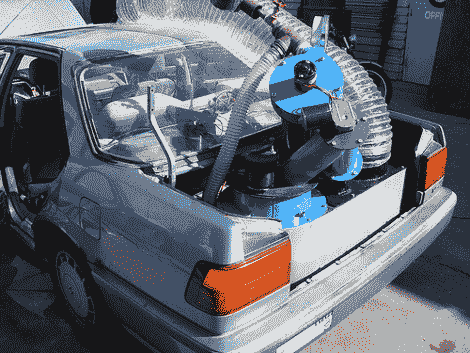

# GEK 是现代的融合先生吗？

> 原文：<https://hackaday.com/2010/03/04/is-gek-a-modern-day-mr-fusion/>

[Nanomonkey]整个周末都在建造用合成气驱动的发电机。[所有能源实验室生产气化炉实验套件](http://www.gekgasifier.com/)将原材料转化为能源。这些设备使用 T2 气化技术从木屑、核桃壳、建筑垃圾或农业废料中制造 T4 天然气燃料。

那么，这就是为德罗宁提供动力的[聚变先生](http://bttf.wikia.com/wiki/Mr._Fusion)？[这辆装有 GEK](http://www.flickr.com/photos/33844192@N04/sets/72157611845184353/) 的本田看起来的确如此。但是玩笑归玩笑，这看起来是一个将废物转化为热能或电能的好方法。网站上有大量的信息可以挖掘。控制器是开源的，这使得当系统被用作发电机时，更容易与[谷歌电表](http://hackaday.com/2010/03/04/google-unveils-api-to-powermeter/)接口。