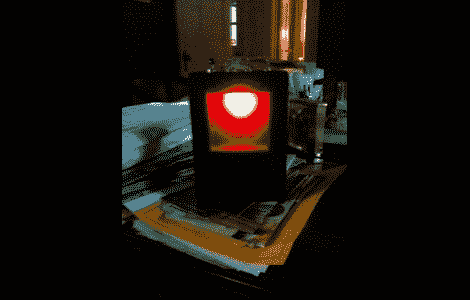

# 就像…我可以通过颜色来判断时间，伙计

> 原文：<https://hackaday.com/2011/05/22/its-like-i-can-tell-the-time-just-by-the-color-man/>

[Alex]降低了他的计时器的分辨率，作为快速可读性的折衷。至少他在描述他的变色钟时是这么宣称的[。它使用 ShiftBrite 根据当前时间慢慢改变时钟的色调。这个概念很有趣:12:00 从白色开始，慢慢地在 3:00 变成绿色，6:00 变成蓝色，9:00 变成红色，12:00 又变回白色，重新开始这个过程。他已经到了这样的地步，只要快速看一下，他就可以在 15 分钟内得到时间。但是他确实需要花几天时间来掌握这项技能，将彩色时钟放在传统的数字时钟旁边。](http://brainlubeonline.com/BLO_ShiftBrite_Clock/How_it_works.html)

构建非常简单，我们敢打赌你已经有了自己需要的东西。[Alex]实际上只是通过使用 ShiftBrite 和 mBed 来证明一个概念，这里不涉及 precision RTC。所以拿起你选择的微控制器，和一个你自己的 RGB LED，看看你是否能再现他的构造。

当然，你也可以选择[制作一款颜色更难辨认的手表](http://hackaday.com/2010/06/07/color-clock-makes-telling-time-impossible/)。